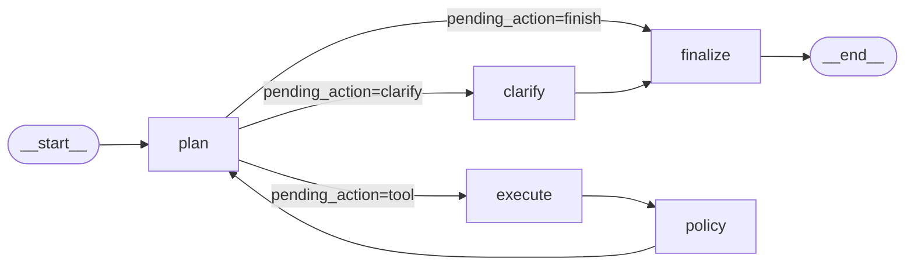
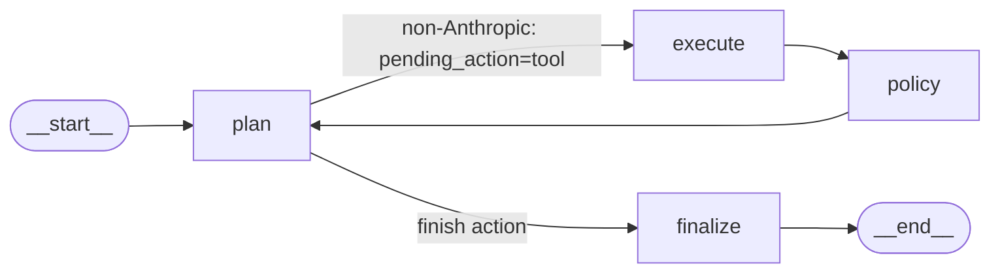
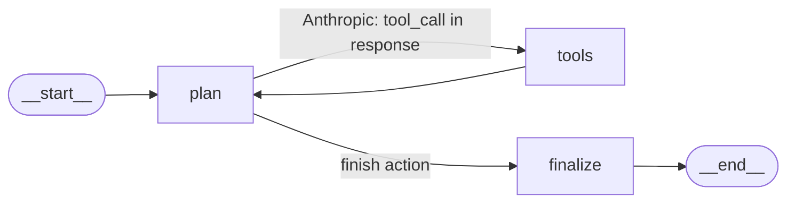
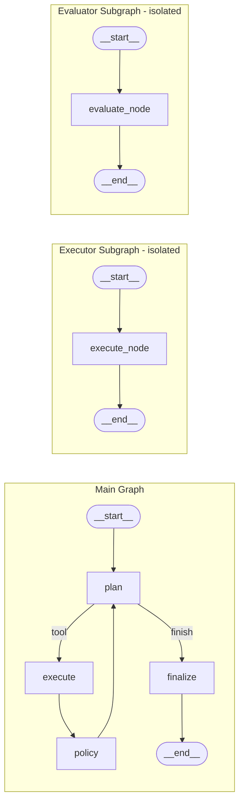
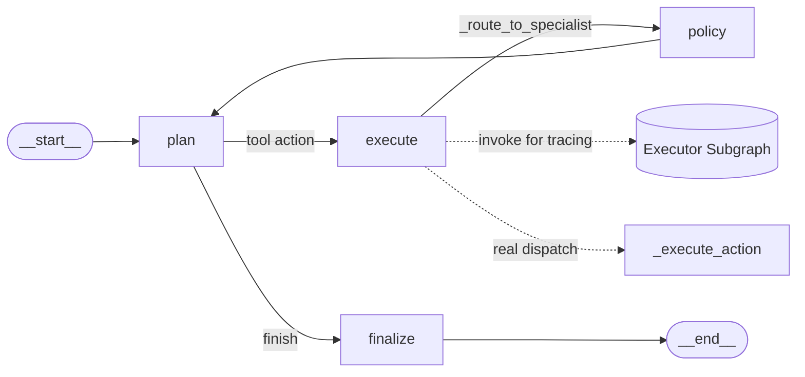

<objective>
Create docs/architecture/PHASE_PROGRESSION.md — a single Markdown file showing the graph topology
progression from Phase 1 through Phase 4 using Mermaid diagrams, then write a smoke test confirming
the file exists and contains expected section markers.

Purpose: LRNG-03 — each completed phase produces a Before/After architecture snapshot making the
build progression explicit and reviewable.

Output: docs/architecture/PHASE_PROGRESSION.md (Mermaid diagrams, graph topology per phase,
specialist boundary story), tests/unit/test_phase_progression_doc.py (smoke test).
</objective>

<execution_context>
@/home/nir/.claude/get-shit-done/workflows/execute-plan.md
@/home/nir/.claude/get-shit-done/templates/summary.md
</execution_context>

<context>
@.planning/PROJECT.md
@.planning/ROADMAP.md
@.planning/phases/05-observability-layer-and-architecture-snapshot/05-CONTEXT.md
@.planning/phases/05-observability-layer-and-architecture-snapshot/05-RESEARCH.md

<interfaces>
<!-- Verified graph topology per phase — extracted from RESEARCH.md and codebase. -->
<!-- These are the facts the document must accurately represent. -->

Phase 1 — Single-loop graph (4 nodes):
  START → plan → execute → policy → plan (loop)
  plan → finalize → END  (on finish action)
  plan → clarify → finalize → END (on clarify action)
  RunState: ~15 fields; plain list tool_history (no reducers); single-provider support

Phase 2 — LangGraph 1.0 upgrade (Anthropic ToolNode path added; Annotated reducers; compaction):
  Standard path (non-Anthropic): identical to Phase 1 loop
  Anthropic path (added): plan →[tools_condition]→ tools (ToolNode) → plan
  RunState: Annotated[list[T], operator.add] reducers on 4 list fields (tool_history,
            mission_reports, memo_events, seen_tool_signatures); message compaction added;
            @observe() on run() and main()

Phase 3 — Specialist subgraphs compiled in isolation (not yet routed):
  Main graph: identical to Phase 2 standard path
  Executor subgraph (isolated): START → execute → END  (ExecutorState TypedDict)
  Evaluator subgraph (isolated): START → evaluate → END  (EvaluatorState TypedDict)
  State isolation: exec_-prefixed fields; isdisjoint() assertion pattern

Phase 4 — Real subgraph routing wired; model routing real:
  Main graph: plan → execute [_route_to_specialist()] → policy → plan
  execute node: calls self._executor_subgraph.invoke(exec_state) for tracing +
                self._execute_action(state) for real tool dispatch (parallel-invoke pattern)
  evaluator: invoked at finalize time via audit_run() — NOT via compiled subgraph in execution path
  ModelRouter: real routing decisions based on task complexity signals (not hardcoded stub)
  Subgraphs cached in __init__() — no per-call recompilation

Key architecture decisions documented in docs/ADR/:
  - ADR-001: langgraph<1.0 pin removal
  - ADR-002: TypedDict over Pydantic BaseModel for RunState
  - ADR-003: Annotated reducers for parallel-safe state
  - ADR-004: ToolNode for Anthropic path only
</interfaces>
</context>

<tasks>

<task type="auto">
  <name>Task 1: Write smoke test for PHASE_PROGRESSION.md</name>
  <files>tests/unit/test_phase_progression_doc.py</files>
  <action>
Create tests/unit/test_phase_progression_doc.py. Write FIRST so the doc task is verified
by automated test (Nyquist rule). This test must FAIL until Task 2 creates the doc.

```python
"""Smoke test: docs/architecture/PHASE_PROGRESSION.md exists and has expected phase sections."""
from __future__ import annotations

import pathlib

PHASE_PROGRESSION_PATH = pathlib.Path("docs/architecture/PHASE_PROGRESSION.md")

EXPECTED_PHASE_HEADINGS = [
    "Phase 1",
    "Phase 2",
    "Phase 3",
    "Phase 4",
]


def test_phase_progression_doc_exists():
    """docs/architecture/PHASE_PROGRESSION.md must exist."""
    assert PHASE_PROGRESSION_PATH.exists(), (
        f"Expected {PHASE_PROGRESSION_PATH} to exist — LRNG-03 architecture snapshot not created."
    )


def test_phase_progression_doc_has_all_phases():
    """PHASE_PROGRESSION.md must contain a section for each phase (Phase 1 through Phase 4)."""
    assert PHASE_PROGRESSION_PATH.exists(), "File missing — cannot check content."
    content = PHASE_PROGRESSION_PATH.read_text(encoding="utf-8")
    for heading in EXPECTED_PHASE_HEADINGS:
        assert heading in content, (
            f"'{heading}' section not found in PHASE_PROGRESSION.md. "
            f"Document must cover all phases 1-4."
        )


def test_phase_progression_doc_has_mermaid():
    """PHASE_PROGRESSION.md must contain at least one Mermaid diagram block."""
    assert PHASE_PROGRESSION_PATH.exists(), "File missing — cannot check content."
    content = PHASE_PROGRESSION_PATH.read_text(encoding="utf-8")
    assert "```mermaid" in content, (
        "No Mermaid diagram found in PHASE_PROGRESSION.md. "
        "Document must include graph topology diagrams."
    )
```

Run path is relative to the repo root (where pytest runs from). The path
`pathlib.Path("docs/architecture/PHASE_PROGRESSION.md")` is relative and resolves
from the working directory where pytest is invoked (project root).
  </action>
  <verify>
    <automated>cd /home/nir/dev/agent_phase0 && pytest tests/unit/test_phase_progression_doc.py -x -q 2>&1 | tail -10</automated>
  </verify>
  <done>test_phase_progression_doc.py exists with 3 smoke tests. All three fail because docs/architecture/PHASE_PROGRESSION.md does not yet exist — expected failure (TDD order).</done>
</task>

<task type="auto">
  <name>Task 2: Create docs/architecture/PHASE_PROGRESSION.md with Mermaid diagrams</name>
  <files>docs/architecture/PHASE_PROGRESSION.md</files>
  <action>
Create docs/architecture/ directory, then create docs/architecture/PHASE_PROGRESSION.md.

The document must be technically dense, author-audience (no LangGraph introductions), written as
a real progression narrative. Follow the style of docs/WALKTHROUGH_PHASE3.md and
docs/WALKTHROUGH_PHASE4.md.

Required sections (H2 headings):

## Phase 1: Baseline Single-Loop Graph

Mermaid diagram:


Content: 4-node graph (plan, execute, policy, finalize) + clarify stub. RunState ~15 fields —
plain list[ToolRecord] for tool_history (no reducers — safe for sequential single-branch graph).
No specialist delegation. MissionAuditor 9-check post-run report. ScriptedProvider for tests.

## Phase 2: LangGraph 1.0 Upgrade — Annotated Reducers + Anthropic ToolNode

Two Mermaid diagrams: one for the standard path, one showing the Anthropic conditional branch.



Content: langgraph<1.0 pin removed (langgraph 1.0.10). Annotated[list[T], operator.add] reducers
on 4 list fields (tool_history, mission_reports, memo_events, seen_tool_signatures) — prevents
silent list overwrite in parallel Send() branches. _sequential_node() wrapper zeros Annotated
fields in return dict (operator.add(post_list, []) = no-op for sequential paths). Message
compaction: sliding window at P1_MESSAGE_COMPACTION_THRESHOLD (default 40). ToolNode added for
Anthropic path via add_conditional_edges("plan", tools_condition). @observe() on run() and main().

## Phase 3: Specialist Subgraph Architecture — State Isolation

Three Mermaid diagrams: main graph (unchanged from Phase 2 standard path), executor subgraph,
evaluator subgraph.



Content: ExecutorState TypedDict (exec_-prefixed fields) and EvaluatorState TypedDict (eval_-
prefixed fields) — zero key overlap with RunState guaranteed by __annotations__ isdisjoint()
assertion in tests. Subgraphs compiled independently via build_executor_subgraph() /
build_evaluator_subgraph() — NOT integrated into main graph routing yet. Why: testability first;
routing integration deferred to Phase 4 once subgraphs are proven in isolation.

## Phase 4: Multi-Agent Integration — Real Subgraph Routing + Model Routing



Content: _route_to_specialist() added to execute node. Parallel-invoke pattern: executor_subgraph
invoked for node transition logging; _execute_action() invoked for real tool dispatch (exec_state
result discarded to prevent double-execution). exec_tool_history copy-back: after _execute_action,
newly appended tool_history entries tagged via_subgraph=True. Evaluator subgraph: compiled in
__init__() but called via audit_run() at _finalize() time — NOT through compiled subgraph invoke in
execution path (avoids partial-audit mid-run overwrite issue). ModelRouter wired in __init__() —
real routing on complexity signals (token_budget_remaining, mission type keyword).

---

## Architecture Summary: What Changed Across Phases

Include a summary table:

| Change | Phase | Files | Why |
|--------|-------|-------|-----|
| Annotated reducers on 4 list fields | Phase 2 | state_schema.py | parallel Send() safety |
| ToolNode for Anthropic path | Phase 2 | graph.py | native tool_call handling |
| ExecutorState/EvaluatorState isolation | Phase 3 | specialist_executor.py, specialist_evaluator.py | separate compilation, testability |
| _route_to_specialist() | Phase 4 | graph.py | real subgraph delegation |
| Parallel-invoke pattern | Phase 4 | graph.py | tracing + real dispatch without double-execution |
| ModelRouter | Phase 4 | model_router.py | complexity-based provider selection |

## Key Design Decisions

Reference existing ADRs without duplicating them. Format:
- ADR-001: langgraph<1.0 pin removal — needed for ToolNode, Annotated reducers, LangGraph 1.0 APIs
- ADR-002: TypedDict for RunState — LangGraph native; Pydantic BaseModel incompatible with LangGraph state management
- ADR-003: Annotated reducers — required for any parallel Send() fan-out (v2 PRLL-01)
- ADR-004: ToolNode for Anthropic path only — preserves existing non-Anthropic paths unchanged

For Phase 5 (this phase): Langfuse CallbackHandler wired via config={"callbacks": [handler]}
in both _compiled.invoke() and _executor_subgraph.invoke() — zero node changes, additive-only.
@observe() now active on OllamaChatProvider.generate (was a no-op due to langfuse 3.x import bug).

---

Accuracy requirements:
- Do not invent node names — use the actual names from graph.py: plan, execute, policy, finalize, clarify, tools
- The parallel-invoke pattern description must match exactly: subgraph invoked FOR TRACING, _execute_action for REAL DISPATCH
- Evaluator: compiled but never invoked via compiled subgraph in execution path — only via audit_run() in _finalize()
- RunState field names: tool_history, mission_reports, memo_events, seen_tool_signatures (the 4 with Annotated reducers)
  </action>
  <verify>
    <automated>cd /home/nir/dev/agent_phase0 && pytest tests/unit/test_phase_progression_doc.py -x -q && pytest tests/ -q 2>&1 | tail -5</automated>
  </verify>
  <done>docs/architecture/PHASE_PROGRESSION.md exists with Phase 1-4 sections and Mermaid diagrams. All 3 smoke tests pass. Full suite remains green.</done>
</task>

</tasks>

<verification>
Architecture snapshot verification:
1. `pytest tests/unit/test_phase_progression_doc.py -v` — all 3 tests green
2. `pytest tests/ -q` — all 394+ tests green
3. `ls docs/architecture/` — PHASE_PROGRESSION.md present
4. `grep -c "```mermaid" docs/architecture/PHASE_PROGRESSION.md` — at least 4 diagrams (one per phase)
5. `grep -E "^## Phase [1-4]" docs/architecture/PHASE_PROGRESSION.md` — 4 matching lines
</verification>

<success_criteria>
- docs/architecture/PHASE_PROGRESSION.md exists as a single coherent document
- Document contains H2 sections "Phase 1" through "Phase 4" with Mermaid graph topology diagrams
- Document accurately describes the parallel-invoke pattern in Phase 4 (tracing vs real dispatch)
- Document accurately describes evaluator subgraph lifecycle (compiled in __init__, called via audit_run only)
- All 3 smoke tests in test_phase_progression_doc.py pass
- Full test suite remains green (394+ tests)
- LRNG-03 closed
</success_criteria>

<output>
After completion, create `.planning/phases/05-observability-layer-and-architecture-snapshot/05-02-SUMMARY.md`
</output>
