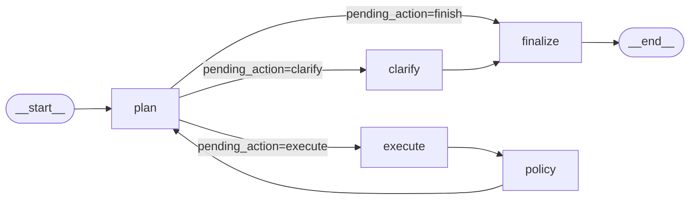
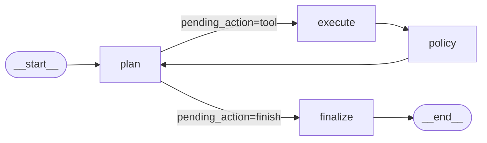

# Phase 5: Observability Layer and Architecture Snapshot - Research

**Researched:** 2026-03-04
**Domain:** Langfuse 3.x wiring, LangGraph callback propagation, architecture documentation
**Confidence:** HIGH

<user_constraints>
## User Constraints (from CONTEXT.md)

### Locked Decisions

- **Langfuse deployment target**: Cloud free tier — cloud.langfuse.com; credentials via `LANGFUSE_PUBLIC_KEY` + `LANGFUSE_SECRET_KEY`
- **CI behavior**: silent no-op when credentials absent; graceful degradation already wired in `observability.py`; no Langfuse secrets needed in CI
- **Additive-only constraint**: no changes to execution path logic, node functions, or state management
- **CallbackHandler wiring**: `LangfuseCallbackHandler` into `self._compiled.invoke(state, config={...})` in `graph.py`
- **Subgraph callbacks**: both `executor_subgraph.invoke(exec_state, config={...})` gets the same handler; evaluator subgraph is NOT invoked in `_route_to_specialist()` — only `_executor_subgraph.invoke()` at line 1283
- **Provider @observe()**: `OllamaChatProvider.generate()` gets `@observe(name="provider.generate")`; `GroqProvider`, `OpenAIProvider`, `ScriptedProvider` skipped
- **Architecture snapshot**: single markdown file `docs/architecture/PHASE_PROGRESSION.md`, Mermaid diagrams, author audience (technically dense), graph topology per phase as primary focus
- **Test for @observe()**: structural unit test asserting `@observe()` is present on `OllamaChatProvider.generate()` — guards against accidental removal

### Claude's Discretion

- Exact Mermaid diagram syntax and layout
- Level of detail for RunState field listings in the snapshot (summary vs exhaustive)
- Whether to include ADR cross-references in the snapshot

### Deferred Ideas (OUT OF SCOPE)

- `@observe()` on `GroqProvider` and `OpenAIProvider`
- Mocked Langfuse test for span emission verification
- Parallel `Send()` fan-out tracing (PRLL-01)
</user_constraints>

<phase_requirements>
## Phase Requirements

| ID | Description | Research Support |
|----|-------------|-----------------|
| OBSV-01 | Langfuse `CallbackHandler` wired in graph invocation `config` so all graph node transitions are traced automatically | CallbackHandler API verified: `from langfuse.langchain import CallbackHandler`; config key `"callbacks": [handler]` confirmed via RunnableConfig; graceful degradation pattern for no-credentials case documented |
| LRNG-03 | Each completed phase produces a "Before/After" architecture snapshot showing system state before and after the phase | docs/architecture/ directory creation; PHASE_PROGRESSION.md format; Mermaid graph topology diagrams for phases 1–4 documented |
</phase_requirements>

---

## Summary

Phase 5 has two distinct workstreams: Langfuse callback wiring and documentation. Neither touches execution path logic. The technical constraint is that `langfuse 3.x` (3.14.5 installed in `.venv`) dropped the `langfuse.decorators` module that `observability.py` currently imports — making all `@observe()` decorators silently no-ops even when credentials are present. This import path issue must be fixed before the `CallbackHandler` wiring will produce traces. The fix is a dual-path import (try 2.x path, fall back to 3.x path) that remains backward-compatible.

The `CallbackHandler` from `langfuse.langchain` integrates with LangGraph through the standard `RunnableConfig` `"callbacks"` key. Verified with the installed `langgraph>=1.0.6` and `langfuse 3.14.5`: `compiled.invoke(state, config={"recursion_limit": N, "callbacks": [handler]})` works without error when credentials are absent (handler self-disables). The only subgraph invoke that needs the callback is `self._executor_subgraph.invoke(exec_state)` at graph.py line 1283; the evaluator subgraph is not invoked in the main execution path.

For the architecture snapshot, the format follows the established `docs/WALKTHROUGH_PHASE3.md` style but captures graph topology at each phase boundary using Mermaid `graph LR` diagrams. The file goes to `docs/architecture/PHASE_PROGRESSION.md` (new directory).

**Primary recommendation:** Fix `observability.py` import path first, then add `get_langfuse_callback_handler()`, then wire `config={"callbacks": callbacks}` into the two invoke calls, then add `@observe` to `OllamaChatProvider.generate()`, then write PHASE_PROGRESSION.md.

---

## Standard Stack

### Core

| Library | Version | Purpose | Why Standard |
|---------|---------|---------|--------------|
| langfuse | 3.14.5 (installed) | LLM observability, tracing | Already in `pyproject.toml [observability]` extra; cloud.langfuse.com free tier |
| langfuse.langchain | via langfuse 3.14.5 | LangChain/LangGraph callback integration | Official Langfuse integration for LangChain ecosystem |
| langchain-core | 1.2.16 (transitive) | BaseCallbackHandler base class for CallbackHandler | Already installed transitively via langchain-anthropic |

### Import Paths (Langfuse 3.x vs 2.x)

| Symbol | Langfuse 2.x (old) | Langfuse 3.x (installed) |
|--------|-------------------|--------------------------|
| `observe` decorator | `from langfuse.decorators import observe` | `from langfuse import observe` |
| `CallbackHandler` | `from langfuse.callback import CallbackHandler` | `from langfuse.langchain import CallbackHandler` |
| `Langfuse` client | `from langfuse import Langfuse` | `from langfuse import Langfuse` (unchanged) |

**CRITICAL:** `langfuse.decorators` does NOT exist in langfuse 3.x. The current `observability.py` imports from `langfuse.decorators` inside a `try/except ImportError` block — so with langfuse 3.14.5 installed, `_langfuse_available` is set to `False` and ALL `@observe()` decorators are no-ops. This must be fixed.

### Alternatives Considered

| Instead of | Could Use | Tradeoff |
|------------|-----------|----------|
| `langfuse.langchain.CallbackHandler` | LangSmith callback | LangSmith not adopted per requirements (out of scope) |
| Automatic node tracing via callback | Manual `@observe()` on each node | Callback approach is additive-only, no node changes needed |

**Installation:**
```bash
# Already in pyproject.toml as optional dependency
pip install -e ".[observability]"
# Which installs: langfuse>=3.0
```

---

## Architecture Patterns

### Pattern 1: observability.py — Dual-Path Import Fix

**What:** Update the `try/except` block in `observability.py` to try both langfuse 2.x and 3.x import paths for the `observe` decorator.

**When to use:** This is a one-time fix required because langfuse 3.x dropped the `decorators` submodule.

**Current (broken with langfuse 3.x):**
```python
# observability.py (current — langfuse.decorators missing in 3.x)
try:
    from langfuse import Langfuse
    from langfuse.decorators import observe as _langfuse_observe  # FAILS in 3.x
    _langfuse_available = True
except ImportError:
    _langfuse_observe = None
```

**Fixed pattern:**
```python
# observability.py (fixed — dual-path import)
_langfuse_observe = None
_langfuse_available = False

try:
    from langfuse import Langfuse
    try:
        from langfuse.decorators import observe as _langfuse_observe  # 2.x path
    except ImportError:
        from langfuse import observe as _langfuse_observe  # 3.x path
    _langfuse_available = True
except ImportError:
    pass
```

### Pattern 2: get_langfuse_callback_handler() — New Function in observability.py

**What:** New function that returns a `LangchainCallbackHandler` or `None`, following the same guard pattern as `get_langfuse_client()`.

**Example:**
```python
# Source: verified via local inspection of langfuse 3.14.5 API
def get_langfuse_callback_handler() -> Any | None:
    """Return a LangchainCallbackHandler if langfuse is available and configured."""
    if not _langfuse_available or not _is_configured():
        return None
    try:
        from langfuse.langchain import CallbackHandler
        return CallbackHandler()
    except Exception:
        return None
```

**Key behavior verified:**
- Without credentials: `CallbackHandler()` instantiates but prints an auth warning and disables itself. Wrapping in `_is_configured()` guard prevents the warning entirely.
- With credentials: `CallbackHandler()` creates a `Langfuse` client internally; `client` attr is a `Langfuse` object.
- `langfuse.langchain` requires `langchain` to be installed — it is present as a transitive dependency (via `langchain-anthropic`); import is guarded in a `try/except`.

### Pattern 3: CallbackHandler Injection into Compiled Graph Invoke

**What:** Pass the handler in `config={"callbacks": [handler]}` to both `self._compiled.invoke()` and `self._executor_subgraph.invoke()`.

**Verified:** `RunnableConfig` TypedDict keys include `callbacks`, `recursion_limit` — both can be combined in one dict.

**Example (graph.py, line 408 area):**
```python
# Source: verified via langgraph 1.0.10 + langfuse 3.14.5 local test
_callback_handler = get_langfuse_callback_handler()
_callbacks = [_callback_handler] if _callback_handler is not None else []
final_state = self._compiled.invoke(
    state,
    config={"recursion_limit": self.max_steps * 9, "callbacks": _callbacks},
)
```

**Example (graph.py, line 1283 area — executor subgraph):**
```python
# Pass same handler list down to executor subgraph
self._executor_subgraph.invoke(exec_state, config={"callbacks": _callbacks})
```

**Note:** `_callbacks` must be built once per `run()` call, not per subgraph invocation. Obtain the handler at the start of `run()` or in `__init__()`. Building it once per `run()` is simplest for the no-credentials path (None check avoids the auth warning).

### Pattern 4: @observe() on OllamaChatProvider.generate()

**What:** Add `@observe(name="provider.generate")` to `OllamaChatProvider.generate()` using the existing `from agentic_workflows.observability import observe` import pattern.

**Example:**
```python
# Source: existing pattern from graph.py line 368
from agentic_workflows.observability import observe

class OllamaChatProvider(_RetryingProviderBase):
    @observe(name="provider.generate")
    def generate(self, messages: Sequence[AgentMessage]) -> str:
        ...
```

**Note:** This decorator is a no-op when langfuse is not configured. After the `observability.py` import fix, it will be an active span when credentials are present.

### Pattern 5: Structural Test for @observe Presence

**What:** A unit test that asserts `OllamaChatProvider.generate` has `__wrapped__` — the standard Python attribute set by `functools.wraps` which both the real `@observe()` decorator and the no-op passthrough set.

**Example:**
```python
# Source: verified via Python introspection
from agentic_workflows.orchestration.langgraph.provider import OllamaChatProvider

def test_ollama_generate_has_observe_decorator():
    """@observe() is wired on OllamaChatProvider.generate — structural guard."""
    method = OllamaChatProvider.generate
    assert hasattr(method, "__wrapped__"), (
        "OllamaChatProvider.generate must be decorated with @observe(). "
        "The decorator was either removed or the import failed silently."
    )
```

**Why `__wrapped__` works:** Both the real langfuse `@observe()` decorator and the fallback no-op `passthrough()` use `functools.wraps`, which sets `__wrapped__`. An undecorated method has no `__wrapped__` attribute. This is a structural guard against accidental removal — it does NOT verify Langfuse connectivity.

### Pattern 6: PHASE_PROGRESSION.md — Mermaid Diagram Format

**What:** Single document showing graph topology at each phase. Mermaid `graph LR` syntax for node/edge diagrams.

**Graph topology per phase (verified from graph.py):**

Phase 1 (baseline — simple loop):
```
START → plan → execute → policy → plan (loop)
plan → finalize → END  (on finish action)
```

Phase 2 (Anthropic ToolNode path added; Annotated reducers; compaction):
```
# Standard path (unchanged):
START → plan → execute → policy → plan
plan → finalize → END

# Anthropic path (added):
START → plan → tools (ToolNode, conditional) → plan
plan → finalize → END  (via tools_condition)
```

Phase 3 (subgraphs compiled in isolation; execute node is a pass-through stub):
```
# Main graph identical to Phase 2 standard path
# Executor subgraph (isolated): START → execute → END
# Evaluator subgraph (isolated): START → evaluate → END
```

Phase 4 (execute node now routes through _route_to_specialist; subgraphs invoked):
```
# Main graph: plan → execute [_route_to_specialist()] → policy → plan
# execute node internally calls:
#   self._executor_subgraph.invoke(exec_state)  [for tracing]
#   self._execute_action(state)                 [for real dispatch]
# evaluator: called at finalize time via audit_run(), NOT via compiled subgraph
```

**Mermaid snippet pattern (verified syntax):**


### Anti-Patterns to Avoid

- **Instantiating `CallbackHandler()` without the `_is_configured()` guard:** produces a console warning on every run even when Langfuse is not in use. Always gate behind `_is_configured()`.
- **Passing `callbacks=[]` vs omitting the key:** Either works. Passing an empty list is safe and avoids conditional dict construction. Both have been tested.
- **Using `@observe('string')` directly (langfuse 3.x):** `observe` from `langfuse` is `observe(func=None, *, name=...)` — passing a positional string arg causes `AttributeError: 'str' object has no attribute '__name__'`. Always use keyword: `@observe(name='string')`, or use the project's `observability.observe` wrapper which handles the keyword correctly.
- **Re-importing `CallbackHandler` inside a hot loop:** import it once at function or module level.

---

## Don't Hand-Roll

| Problem | Don't Build | Use Instead | Why |
|---------|-------------|-------------|-----|
| Node-level tracing | Custom trace logging in each graph node | `CallbackHandler` in `config={"callbacks": ...}` | Automatic; zero node changes required; LangGraph fires callbacks on every node transition |
| LLM call tracing | Manual timing/logging around `generate()` | `@observe()` decorator | Span is created/closed automatically, including exceptions |
| Credential validation | Custom env-var check | `_is_configured()` in `observability.py` | Already implemented; reuse the pattern |

**Key insight:** The LangGraph callback system is already integrated with `langchain-core`'s `BaseCallbackHandler`. Any `BaseCallbackHandler` subclass passed in `config["callbacks"]` receives lifecycle events for every chain/node start/end/error — no per-node instrumentation needed.

---

## Common Pitfalls

### Pitfall 1: langfuse.decorators ImportError Sets _langfuse_available=False

**What goes wrong:** With langfuse 3.x installed, `observability.py` silently sets `_langfuse_available = False`. All `@observe()` calls return a no-op passthrough. Even with valid credentials, no spans appear in Langfuse.

**Why it happens:** The current `observability.py` imports `from langfuse.decorators import observe` inside a single `try/except ImportError`. In langfuse 2.x this worked; in 3.x the `decorators` submodule was removed. The `ImportError` is caught, `_langfuse_observe` stays `None`, and `_langfuse_available` stays `False`.

**How to avoid:** Dual-path import: try `langfuse.decorators` first (2.x compat), then fall back to `from langfuse import observe` (3.x). Set `_langfuse_available = True` when either path succeeds.

**Warning signs:** Running `python3 -c "from agentic_workflows.observability import _langfuse_available; print(_langfuse_available)"` returns `False` even after `pip install langfuse`.

### Pitfall 2: CallbackHandler Instantiated Without Credentials Produces Console Noise

**What goes wrong:** `CallbackHandler()` with no `LANGFUSE_PUBLIC_KEY` prints `Authentication error: Langfuse client initialized without public_key. Client will be disabled.` to stderr on every run.

**Why it happens:** The `CallbackHandler.__init__` always constructs a `Langfuse` client which validates credentials on init.

**How to avoid:** Gate instantiation behind `_is_configured()`. Return `None` from `get_langfuse_callback_handler()` when credentials are absent; pass `config={"callbacks": []}` when `None`.

**Warning signs:** Auth error printed to console when running tests.

### Pitfall 3: Test Suite Breaks When Callback is Passed to Subgraph

**What goes wrong:** The CONTEXT.md explicitly notes: "If tests fail after subgraph callback wiring: investigate the root cause."

**Why it happens:** The `CallbackHandler` inherits from `BaseCallbackHandler` which expects `langchain` to be available. In CI without langfuse credentials, `get_langfuse_callback_handler()` returns `None` and `callbacks=[]` — no issue. But if the guard fails, a disabled `CallbackHandler` with internal errors could propagate.

**How to avoid:** Always guard with `_is_configured()`. When `None` is returned, pass `callbacks=[]` not `callbacks=[None]`.

**Warning signs:** `AttributeError` or `ValidationError` in subgraph invoke during tests.

### Pitfall 4: Evaluator Subgraph Does Not Have a Direct invoke() Call in Graph.py

**What goes wrong:** Plan tries to add callback config to `self._evaluator_subgraph.invoke()` but this call does not exist in the current codebase's execution path.

**Why it happens:** The evaluator subgraph is compiled at `__init__()` but never invoked from `_route_to_specialist()`. Audit happens via `audit_run()` in `_finalize()`. The only subgraph invoke in the main flow is `self._executor_subgraph.invoke(exec_state)` at graph.py line 1283.

**How to avoid:** Only wire callbacks into `self._compiled.invoke()` and `self._executor_subgraph.invoke()`. Do NOT search for `_evaluator_subgraph.invoke()` — it does not exist in the execution path.

### Pitfall 5: observe() Called as @observe('string') on OllamaChatProvider

**What goes wrong:** Using `@observe('provider.generate')` (positional string) directly from `langfuse` 3.x causes `AttributeError` at decoration time.

**Why it happens:** langfuse 3.x `observe(func=None, *, name=...)` — `name` is keyword-only. Passing a positional string is interpreted as `func`, which then fails when langfuse tries to access `func.__name__`.

**How to avoid:** Use the project's `from agentic_workflows.observability import observe` wrapper which internally calls `_langfuse_observe(name=name)` — keyword form is correct. Or use `@observe(name='provider.generate')` explicitly.

---

## Code Examples

### Complete CallbackHandler Wiring in graph.py run()

```python
# Source: verified pattern — graph.py line 368-408 + langfuse 3.14.5 API
from agentic_workflows.observability import observe, get_langfuse_callback_handler

@observe("langgraph.orchestrator.run")
def run(self, user_input: str, ...) -> dict[str, Any]:
    ...
    # Build callback list once per run (no-credentials = empty list, no console noise)
    _callback_handler = get_langfuse_callback_handler()
    _callbacks = [_callback_handler] if _callback_handler is not None else []

    final_state = self._compiled.invoke(
        state,
        config={"recursion_limit": self.max_steps * 9, "callbacks": _callbacks},
    )
```

### Executor Subgraph Invoke with Callbacks (graph.py ~line 1283)

```python
# Source: graph.py line 1283; _callbacks must be in scope from run()
# Need to thread _callbacks through _route_to_specialist or store on self
self._executor_subgraph.invoke(exec_state, config={"callbacks": _callbacks})
```

**Design note:** `_callbacks` needs to be accessible in `_route_to_specialist()`. Options:
1. Store `self._active_callbacks` on the orchestrator at start of each `run()` call
2. Thread it through as a parameter to `_route_to_specialist()`
Option 1 is simpler and consistent with the `_compiled` and `_executor_subgraph` pattern.

### observability.py — get_langfuse_callback_handler()

```python
# Source: verified via local langfuse 3.14.5 inspection
def get_langfuse_callback_handler() -> Any | None:
    """Return a LangchainCallbackHandler if langfuse is available and configured, else None."""
    if not _langfuse_available or not _is_configured():
        return None
    try:
        from langfuse.langchain import CallbackHandler  # requires langchain installed
        return CallbackHandler()
    except Exception:
        return None
```

### observability.py — Dual-Path Import Fix

```python
# Source: verified by testing both paths against langfuse 3.14.5
_langfuse_observe = None
_langfuse_available = False

try:
    from langfuse import Langfuse
    try:
        from langfuse.decorators import observe as _langfuse_observe  # langfuse 2.x
    except ImportError:
        from langfuse import observe as _langfuse_observe  # langfuse 3.x
    _langfuse_available = True
except ImportError:
    pass
```

### Test: Structural @observe Guard for OllamaChatProvider.generate

```python
# Source: verified via Python __wrapped__ introspection
from agentic_workflows.orchestration.langgraph.provider import OllamaChatProvider

def test_ollama_generate_has_observe_decorator():
    """OllamaChatProvider.generate must have @observe() — structural guard."""
    assert hasattr(OllamaChatProvider.generate, "__wrapped__"), (
        "OllamaChatProvider.generate must be decorated with @observe(). "
        "Decorator was removed or import failed silently."
    )
```

### PHASE_PROGRESSION.md — Mermaid Phase 1 Baseline

```markdown
## Phase 1: Baseline Single-Loop Graph



**Nodes:** `plan` (_plan_next_action), `execute` (_execute_action direct), `policy` (_enforce_memo_policy), `finalize` (_finalize)
**RunState fields:** ~15 fields — messages, tool_history (plain list), missions, pending_action, final_answer
```

---

## State of the Art

| Old Approach | Current Approach | When Changed | Impact |
|--------------|------------------|--------------|--------|
| `langfuse.decorators.observe` | `langfuse.observe` | langfuse 3.0 | `observability.py` import broken with 3.x; needs dual-path fix |
| `langfuse.callback.CallbackHandler` | `langfuse.langchain.CallbackHandler` | langfuse 3.0 | Different import path; same interface |
| Manual trace logging per node | `CallbackHandler` in invoke config | LangGraph 1.0 + Langfuse 3.x | Automatic node-level tracing, zero node changes |

**Deprecated/outdated:**
- `langfuse.decorators` submodule: removed in langfuse 3.x. Use `from langfuse import observe` instead.
- `langfuse.callback` submodule: removed in langfuse 3.x. Use `from langfuse.langchain import CallbackHandler` instead.

---

## Open Questions

1. **Where to store `_callbacks` for access in `_route_to_specialist()`**
   - What we know: `run()` is the right place to build the handler; `_route_to_specialist()` is called inside `_compiled.invoke()` as a graph node function
   - What's unclear: whether to use `self._active_callbacks` (instance attribute set at start of `run()`) or refactor `_route_to_specialist()` to accept a parameter
   - Recommendation: Use `self._active_callbacks: list[Any] = []` set at the start of `run()`, reset to `[]` at the end. Simple, no signature changes to node functions.

2. **`docs/architecture/` directory — use `docs/phases/` or new `docs/architecture/`?**
   - What we know: CONTEXT.md specifies `docs/architecture/PHASE_PROGRESSION.md`; existing docs live at `docs/` root (`WALKTHROUGH_*.md`) or `docs/ADR/`
   - What's unclear: nothing — CONTEXT.md is explicit
   - Recommendation: Create `docs/architecture/` as a new subdirectory. This matches CONTEXT.md exactly.

---

## Validation Architecture

### Test Framework

| Property | Value |
|----------|-------|
| Framework | pytest 8.x |
| Config file | `pyproject.toml` (`[tool.pytest.ini_options]`) |
| Quick run command | `pytest tests/unit/test_observability.py -x -q` |
| Full suite command | `pytest tests/ -q` |

### Phase Requirements to Test Map

| Req ID | Behavior | Test Type | Automated Command | File Exists? |
|--------|----------|-----------|-------------------|-------------|
| OBSV-01 | `LangfuseCallbackHandler` wired in graph invoke config | unit (structural wiring) | `pytest tests/unit/test_observability.py -x -q` | No — Wave 0 |
| OBSV-01 | `_langfuse_available=True` with langfuse 3.x installed | unit | `pytest tests/unit/test_observability.py::test_langfuse_available_with_3x -x` | No — Wave 0 |
| OBSV-02 (already closed) | `@observe()` on `run()` | unit (existing) | Already tested via integration suite | Yes |
| LRNG-03 | `docs/architecture/PHASE_PROGRESSION.md` exists | smoke | `pytest tests/unit/test_phase_progression_doc.py -x` | No — Wave 0 |
| Phase 5 SC#2 | `@observe()` present on `OllamaChatProvider.generate` | unit (structural) | `pytest tests/unit/test_observability.py::test_ollama_generate_has_observe_decorator -x` | No — Wave 0 |

**Note:** Langfuse span emission to cloud.langfuse.com is NOT automatically tested (requires live credentials). SC#1 verified manually post-implementation.

### Sampling Rate

- **Per task commit:** `pytest tests/unit/test_observability.py -x -q && pytest tests/ -q --co -q | tail -1`
- **Per wave merge:** `pytest tests/ -q` (all 420+ tests must stay green)
- **Phase gate:** Full suite green before `/gsd:verify-work`

### Wave 0 Gaps

- [ ] `tests/unit/test_observability.py` — covers OBSV-01 structural wiring checks, `_langfuse_available` fix verification, `@observe()` structural guard for `OllamaChatProvider.generate`, `get_langfuse_callback_handler()` None-guard behavior
- [ ] `tests/unit/test_phase_progression_doc.py` — smoke test: `docs/architecture/PHASE_PROGRESSION.md` exists and contains expected phase sections
- [ ] `docs/architecture/` directory — created as part of plan execution

---

## Sources

### Primary (HIGH confidence)

- Local langfuse 3.14.5 inspection — `import langfuse; dir(langfuse)`, submodule enumeration via `pkgutil.walk_packages`
- Local API verification — `CallbackHandler.__init__` signature, `RunnableConfig` TypedDict keys, `observe` function signature
- LangGraph 1.0.10 local test — `compiled.invoke(state, config={"callbacks": [handler]})` and subgraph invoke with callbacks — both confirmed working
- `observability.py` source code — current import structure and `_is_configured()` pattern
- `graph.py` source code — exact inject points: line 408 (`_compiled.invoke`) and line 1283 (`_executor_subgraph.invoke`)
- `provider.py` source code — `OllamaChatProvider.generate` method signature confirmed; class name is `OllamaChatProvider` (CONTEXT.md uses `OllamaProvider` as shorthand)
- `pyproject.toml` — `observability = ["langfuse>=3.0"]` optional extra; langfuse 3.14.5 satisfies `>=3.0`

### Secondary (MEDIUM confidence)

- `docs/WALKTHROUGH_PHASE3.md` and `docs/WALKTHROUGH_PHASE4.md` — documentation style established for PHASE_PROGRESSION.md
- `docs/ADR/` directory structure — confirms docs/ADR/ exists; docs/architecture/ is a new directory

### Tertiary (LOW confidence)

- Mermaid syntax compatibility with GitHub rendering — standard `graph LR` syntax; not locally verified but universally supported in GitHub Markdown

---

## Metadata

**Confidence breakdown:**
- Standard stack: HIGH — langfuse 3.14.5 installed, all imports verified locally
- Architecture (import fix): HIGH — root cause identified by direct module inspection
- Architecture (callback wiring): HIGH — `compiled.invoke` and subgraph invoke tested locally with real `LangchainCallbackHandler`
- Architecture (observe decorator): HIGH — `__wrapped__` attribute behavior verified via Python introspection
- Pitfalls: HIGH — all pitfalls discovered through direct testing, not hypothetical
- Architecture snapshot (Mermaid): MEDIUM — diagram syntax verified; actual rendering depends on Markdown viewer

**Research date:** 2026-03-04
**Valid until:** 2026-04-04 (langfuse API is stable; LangGraph callback contract stable in 1.x)
