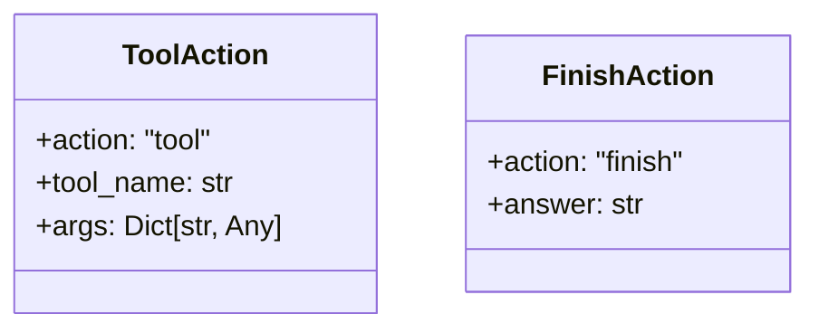
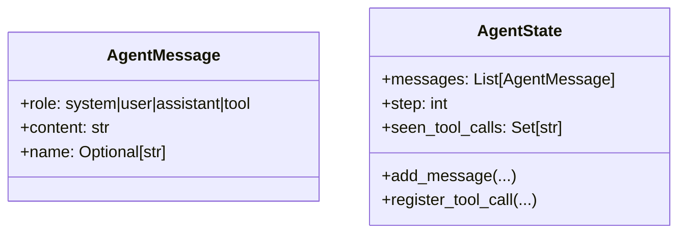
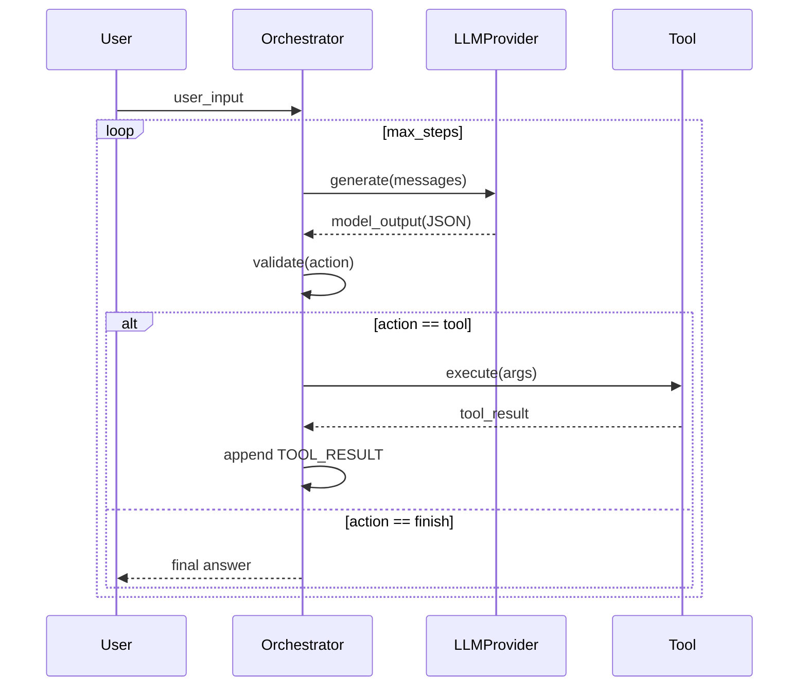

# Project Blueprint (Phase 0 Baseline + Phase 4 Target)

## 1. Scope
This document defines the current architecture and a production-grade implementation roadmap for the `agent_phase0` repository.

Note: `plan.md` is not present in this repo. The phase roadmap below is derived from `deep-research-report.md` and extended with a concrete **Phase 4** implementation target.

## 2. Full Project Tree
```text
agent_phase0/
├── .env
├── .gitignore
├── README.md
├── PROJECT_BLUEPRINT.md
├── deep-research-report.md
├── requirements.txt
├── main.py
├── orchestrator.py
├── llm_provider.py
├── agent_state.py
├── schemas.py
├── errors.py
├── logger.py
├── scripts/
│   └── list_models.py
├── tests/
│   ├── groq_test.py
│   └── testenv.py
├── tools/
│   ├── __init__.py
│   ├── base.py
│   ├── echo.py
│   ├── read_file.py
│   └── write_file.py
├── __pycache__/
└── .venv/
```

## 3. System Overview
Current system is a deterministic tool-using CLI agent with strict JSON output contracts:
- Orchestrator loop with max-step exit condition.
- LLM adapter (Groq) for model generation.
- Tool abstraction (`Tool`) with one registered tool (`echo`).
- Pydantic action schema validation (`ToolAction`, `FinishAction`).
- Error taxonomy split by retryable/fatal control flow.
- Minimal in-memory agent state including dedupe of identical tool calls.

## 4. Subsystems

### 4.1 Entry Layer
- `main.py`
- Responsibility: bootstraps `Orchestrator`, passes user input, starts run.

### 4.2 Orchestration Layer
- `orchestrator.py`
- Responsibility: run loop, prompt policy, model call, schema validation, tool dispatch, retry/fail semantics.

### 4.3 Model Provider Layer
- `llm_provider.py`
- Responsibility: load API key, call Groq chat completions, normalize model output.

### 4.4 State Layer
- `agent_state.py`
- Responsibility: conversation state, step tracking, repeated tool-call prevention via signature hashing.

### 4.5 Contract Layer
- `schemas.py`
- Responsibility: strict runtime action contracts with Pydantic.

### 4.6 Tool Layer
- `tools/base.py`: tool interface.
- `tools/echo.py`: concrete echo implementation.
- `tools/read_file.py`, `tools/write_file.py`: placeholders (empty, not active).

### 4.7 Error/Logging Layer
- `errors.py`: typed domain errors with retry/fatal classification.
- `logger.py`: shared structured logger factory.

### 4.8 Utility + Tests
- `scripts/list_models.py`: model discovery utility.
- `tests/`: currently smoke/manual tests; no full automated harness yet.

## 5. Main APIs (Current)

### 5.1 `Orchestrator`
```python
class Orchestrator:
    def __init__(self): ...
    def run(self, user_input: str): ...
    def _handle_tool(self, action: ToolAction) -> Dict[str, Any]: ...
    def _validate_input(self, text: str) -> ToolAction | FinishAction: ...
```
Behavior:
- Executes up to `max_steps` (currently 5).
- Requires model outputs to be strict JSON with `action` in `{tool, finish}`.
- Retries on retryable errors; aborts on fatal errors.

### 5.2 `LLMProvider`
```python
class LLMProvider:
    def __init__(self, model: str = "llama-3.1-8b-instant"): ...
    def generate(self, messages: Sequence[AgentMessage]) -> str: ...
```
Behavior:
- Uses `GROQ_API_KEY` from environment.
- Raises `LLMError` on provider/response issues.

### 5.3 `AgentState`
```python
@dataclass
class AgentState:
    messages: List[AgentMessage]
    step: int = 0
    seen_tool_calls: Set[str]

    def add_message(self, role, content, name=None) -> None: ...
    def register_tool_call(self, tool_name: str, args: Dict) -> bool: ...
```
Behavior:
- Returns `False` for repeated identical `(tool_name, args)` calls.

### 5.4 Tool Interface
```python
class Tool:
    name: str
    description: str
    def execute(self, args: Dict[str, Any]) -> Dict[str, Any]: ...
```

## 6. Schema Visualization

### 6.1 Action Schema (Runtime)


### 6.2 Agent State Schema


### 6.3 Runtime Flow


## 7. Production-Grade Requirements
These are required to move from current Phase 0 baseline to production-ready behavior:

- Security
- Tool allowlist with risk tiering (read/write/privileged).
- Prompt injection and data exfiltration checks before tool execution.
- Secret handling via environment/secret manager only.

- Reliability
- Tool timeouts, retries, and circuit breaker logic.
- Idempotency keys for state-changing tools.
- Run resumption and replay from persisted state/event log.

- Observability
- Structured event schema for each run/step/tool/error.
- OpenTelemetry spans and correlation IDs.
- Cost and token accounting per run.

- Governance
- Human approval gates for high-risk actions.
- Audit trail with immutable run records.
- Policy enforcement at orchestration boundary.

- Quality
- Deterministic unit/integration tests.
- Scenario-based eval harness (happy path + failure modes).
- CI quality gates (tests, lint, schema contract checks).

## 8. Features To Implement (Phase 0 to Phase 4)

### Phase 0 (Complete/Current + Gaps)
- Strict action schema validation.
- Max-step guard and retry/fatal error split.
- Basic tool architecture.
- Remaining gap: structured run transcript persisted to disk.

### Phase 1 (Framework Literacy)
- Add alternate orchestration prototype (e.g., LangGraph) for parity comparison.
- Add checkpointed state flow and callback tracing hooks.
- Add memory adapter interface (`short_term`, `long_term`, retrieval).

### Phase 2 (Custom Rebuild + Guardrails)
- Build internal plugin registry for tools with explicit metadata:
  - `name`, `risk_tier`, `timeout_ms`, `input_schema`, `output_schema`.
- Add deterministic event log + run replay.
- Add guardrail pipeline:
  - prompt injection scanner
  - PII/content policy scanner
  - output schema validator
- Add human-in-loop interrupt for `risk_tier=high` tools.

### Phase 3 (Production Service)
- Port orchestrator to TypeScript service layer.
- Define service contracts with Zod.
- Add OpenTelemetry traces, metrics, logs.
- Add budget/rate limits and tenant-level quotas.
- Add CI eval suite with regression + red-team scenarios.

### Phase 4 (Enterprise Runtime Hardening)
- Multi-tenant control plane + isolated execution workers.
- Policy-as-code engine for runtime authorization.
- Signed tool manifests and provenance verification.
- Canary deployments for prompts/models/tool versions.
- SLO-based autoscaling and incident playbooks.
- Compliance pack:
  - immutable audit export
  - retention policies
  - access review workflow

## 9. Target API Surface (Post-Phase 4)

```python
class AgentRuntime:
    def run(self, request: RunRequest) -> RunResult: ...
    def resume(self, run_id: str, approval: ApprovalDecision | None = None) -> RunResult: ...
    def replay(self, run_id: str) -> ReplayResult: ...

class ToolRegistry:
    def register(self, spec: ToolSpec) -> None: ...
    def execute(self, tool_name: str, args: dict, ctx: ToolContext) -> dict: ...

class PolicyEngine:
    def authorize(self, action: ProposedAction, ctx: PolicyContext) -> PolicyDecision: ...
```

## 10. Immediate Implementation Backlog
1. Implement `tools/read_file.py` and `tools/write_file.py` with strict input/output schemas and risk-tier controls.
2. Add event log persistence (`run_id`, `step`, `action`, `tool`, `latency_ms`, `error`).
3. Add pytest-based orchestrator tests for invalid JSON, unknown action, repeated tool call, and max-step exits.
4. Add `.env.example` + startup validation for required configuration.
5. Add lint/type checks and CI workflow.
