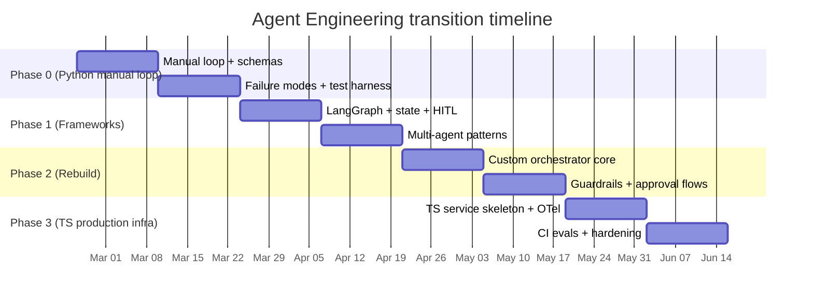

# Comprehensive Learning and Transition Plan for Agent Engineering

## Executive summary

Agent engineering is the discipline of building **LLM-driven control loops** that can (a) decide when to call external tools, (b) manage state and memory across steps, and (c) operate safely under real-world constraints such as cost, latency, security, and human approval. Modern “tool calling” (also called function calling) formalizes how a model requests actions by emitting structured tool invocations defined by a JSON Schema, so your application can execute tools deterministically and return results back into the loop. citeturn3search0turn3search3turn3search2

Across both literature and production guidance, two themes are consistent:

- **Start with a single-agent loop and a small toolset**, then scale to multi-agent orchestration only when you can’t reliably solve the workflow with one agent. This is explicitly recommended in production-oriented guidance (incremental approach; “maximize a single agent’s capabilities first”), because splitting into multiple agents introduces additional complexity and failure modes. citeturn22view0turn7view2  
- **Guardrails and oversight are not optional**: layered defenses (rules + model-based classifiers + moderation + output validation) are a practical baseline for mitigating prompt injection, data leakage, and unsafe actions; high-impact tools should be gated by risk scoring and (often) human intervention. citeturn23view0turn23view1turn0search2turn11search0

A practical transition path that consistently works is:

- **Phase 0**: Python sandbox, manual loop, strict schemas, minimal tools (learn the mechanics and failure modes).  
- **Phase 1**: Adopt one or two frameworks to learn established abstractions (graph/state orchestration, memory, observability, multi-agent patterns). citeturn1search1turn24view0turn5search0  
- **Phase 2**: Rebuild core pieces from scratch (orchestrator, tool boundary, state, audit, eval harness). This cements “agency vs control” thinking and prevents framework lock-in. citeturn24view0turn7view2  
- **Phase 3**: Production-grade TypeScript infrastructure (service boundaries, observability, rate/cost controls, secure tool execution, human-in-loop, CI evals).

### Phase completion (this repo)

- [x] Phase 0: Python sandbox agent loop exists (`main.py`, `orchestrator.py`, `tools/`)
- [x] Phase 1: Framework literacy implementation completed in this repo via LangGraph (`execution/langgraph/`, `execution/notebooks/p1_*.ipynb`)
- [ ] Phase 2: Rebuild core pieces (audit schema, replayable runs, hardened tool boundary)
- [ ] Phase 3: Production TypeScript infrastructure (service boundaries, tracing, budgets, CI evals)

## Foundations you should internalize before building

Agent engineering is less about “smart prompting” and more about **system design**: how to combine probabilistic model outputs with deterministic code paths.

### Core primitives

An agent run is typically implemented as a loop that continues until an exit condition is reached—common exit conditions include “tool call emitted,” “final structured output,” “error,” or “maximum turns.” citeturn7view2turn22view0

Tool calling is a contract: tools are callable functions with well-defined inputs/outputs; the model decides when to invoke a tool and what arguments to provide. citeturn1search18turn3search0

For reliability, **schema enforcement** matters. OpenAI’s Structured Outputs are explicitly designed to ensure outputs conform to a provided JSON Schema (via function calling or json_schema response formats). citeturn3search2turn3search20

### Canonical reasoning/acting patterns from literature

The modern “agent” lineage is well captured by a few foundational research threads:

- **Chain-of-Thought prompting**: intermediate reasoning steps can improve multi-step reasoning performance, but doesn’t inherently add tool use or state management. citeturn4search0  
- **ReAct**: explicitly interleaves reasoning and actions (tool/environment interactions) to reduce hallucination and enable grounded information gathering. citeturn0search0turn0search4  
- **Tool-use training and selection**: systems like Toolformer formalize learning when and how to call APIs/tools, reinforcing “tool selection” as a first-class capability. citeturn4search1turn4search5  
- **Deliberate search over reasoning paths**: Tree-of-Thoughts generalizes beyond a single chain to explore multiple candidate paths and self-evaluate. citeturn4search2turn4search6  
- **Reflection + episodic memory**: Reflexion shows performance gains by storing linguistic feedback in memory and learning across trials without weight updates. citeturn0search1turn0search9  
- **Long-horizon memory / agent behavior**: Generative Agents emphasizes retrieval + reflection + planning as the basis for coherent long-running behavior. citeturn4search3turn4search19

### Security and risk management foundations

Agents introduce new risk surfaces because they (a) ingest untrusted text, and (b) can take actions.

- The **entity["organization","OWASP","application security project"] Top 10 for LLM Applications** identifies common classes of vulnerabilities such as prompt injection, insecure output handling, model DoS/cost exhaustion, and supply-chain risks. citeturn0search2turn0search10  
- Prompt injection is not theoretical: research demonstrates practical attacks against LLM-integrated applications. citeturn11search0  
- Risk management frameworks like the **entity["organization","NIST","us standards institute"] AI RMF** provide a vocabulary for trustworthiness characteristics and organizational controls for AI systems. citeturn6view1turn22view3

### Architectural baseline you should converge on

```mermaid
flowchart TB
  U[User / System Trigger] --> IN[Input pre-processing\nlimits, authz, policy]
  IN --> G1[Input guardrails\nPII/jailbreak/relevance]
  G1 -->|safe| P[Planner LLM\n(tool-call capable)]
  G1 -->|unsafe| STOP[Refuse / escalate]

  P -->|tool call| TBND[Tool boundary\nschema validate + allowlist]
  TBND -->|approved| TOOL[Execute tool\nsandbox / permissions]
  TBND -->|blocked| ESC[Escalate / ask human]

  TOOL --> OBS[Audit + trace\nstructured event log]
  P -->|final output| OUT[Final response\n(output validation)]

  OBS --> P
  OUT --> OBS
```

This reflects practical guidance that guardrails should be layered, and that authentication/authorization and access controls remain necessary even with LLM-based safety checks. citeturn23view0turn23view1turn8view0

## Comparative catalog of baselines and frameworks

The table below is designed as an engineering-facing catalog. “Maturity signal” is a qualitative summary backed by public artifacts such as repository traction, documentation depth, and stated production features (note: star counts change over time).

### Frameworks and baselines overview

| Baseline / framework | Language(s) | Maturity signal | Typical use-cases | Notable pros | Notable cons | License / terms | Primary docs & repos |
|---|---|---|---|---|---|---|---|
| LangChain | Python, TypeScript citeturn1search14turn17search8 | High adoption; large ecosystem and integrations citeturn2search5 | Fast prototyping; tool-using agents; RAG apps | Huge integration surface; strong “tools/agents” conceptual model citeturn1search18turn1search22 | Abstraction complexity; reliability depends on how you compose agents | MIT citeturn2search2 | citeturn1search14turn2search5turn17search17 |
| LangGraph | Python, TypeScript (LangGraph.js) citeturn12search11turn17search0 | Production-oriented orchestration focus; explicit state and persistence citeturn2search8turn15search3 | Long-running stateful agents; human-in-loop; graph workflows | Explicit control (state machine), interrupts, persistence for HITL citeturn15search3turn15search1 | Requires disciplined state modeling; “graph-first” learning curve | MIT citeturn12search0 | citeturn1search11turn15search3turn17search0 |
| AutoGen | Python citeturn1search2turn1search9 | Mature multi-agent research-to-app framework; maintained w/ security fixes citeturn1search2 | Multi-agent collaboration; agent-chat patterns | Built-in tracing/observability via OpenTelemetry citeturn14search2 | Project points new users to a successor framework; migration might be needed citeturn1search2 | CC BY 4.0 citeturn20view0 | citeturn1search2turn14search2turn1search9 |
| entity["organization","Microsoft","technology company"] Agent Framework | Python, .NET citeturn15search17turn2search20 | Newer; positioned as successor combining ideas from predecessor projects citeturn15search6 | Enterprise multi-agent workflows; type safety + telemetry | Middleware hooks for logging/security/error handling; telemetry emphasis citeturn15search9turn15search6 | Newer “preview” feel implies churn risk (APIs may shift) citeturn1search20 | MIT citeturn15search17 | citeturn15search6turn15search9turn15search17 |
| LlamaIndex | Python, TypeScript citeturn12search5turn17search2 | High adoption in “agents over data” niche citeturn12search5 | Data-centric agents; RAG + tool use; memory | Strong memory abstractions; observability/instrumentation modules citeturn1search3turn14search7turn14search3 | Broad ecosystem can be complex; need careful component selection | MIT citeturn12search1 | citeturn1search13turn17search2turn14search7 |
| CrewAI | Python citeturn13search7turn17search7 | High adoption for “role-based multi-agent crews” citeturn13search7 | Multi-agent teamwork; task pipelines with roles/goals | Built-in concepts for tasks, memory, and guardrails in docs citeturn2search13turn15search4turn15search0 | Some guardrail/observability features appear enterprise-tier; verify OSS limits citeturn15search2 | MIT citeturn13search3 | citeturn2search3turn13search7turn15search4 |
| entity["organization","deepset","nlp company"] Haystack | Python citeturn12search3 | Mature orchestration for production LLM pipelines; explicit architecture citeturn12search3 | “Agent in a pipeline”; explicit tool invocation components | Clear tool-calling components (Tool, ToolInvoker) citeturn5search0turn5search19 | Less “agentic by default” than some frameworks; you assemble pieces | Apache-2.0 citeturn12search7 | citeturn5search0turn12search3turn5search4 |
| Semantic Kernel | C#, Python, Java (and broader ecosystem) citeturn13search8 | Mature enterprise orientation citeturn13search4 | Enterprise agent middleware; plugins/skilled functions | Agent framework support in docs; broad language support citeturn2search12turn13search8 | Larger surface area; enterprise patterns increase learning curve | MIT citeturn13search0 | citeturn13search8turn2search12turn13search4 |
| PydanticAI | Python citeturn12search6turn5search9 | Growing; schema-first agent approach citeturn5search1 | Structured outputs; tool calling + validation | Emphasis on structured outputs / typed agent building citeturn5search1 | Tool-calling ergonomics vary by provider/tooling choices citeturn5search9 | MIT citeturn12search6 | citeturn12search6turn5search9 |
| DSPy | Python citeturn5search2turn5search6 | Research-to-practice; “programming not prompting” niche citeturn5search2 | Optimizing prompts/weights; modular AI programs (incl. agent loops) | Built-in modules abstract prompting techniques incl. ReAct citeturn5search10 | Not an orchestration/runtime framework; complements agents rather than replaces | MIT (repo badge) citeturn5search2 | citeturn5search2turn5search6turn5search10 |
| OpenAI function calling baseline | Any client language; API-level concept citeturn3search0 | Highly mature API capability; widely supported pattern | Tool calling; structured tool arguments; “bring your own loop” | JSON Schema-defined function tools; “tool calling” is first-class citeturn3search0turn3search3 | You must implement orchestration, state, retries, guardrails yourself | Proprietary service terms | citeturn3search0turn3search2turn3search3 |
| OpenAI Agents SDK | Python, TypeScript citeturn3search1turn13search14 | Positioned as production-ready; small set of primitives citeturn13search6 | Multi-agent workflows; handoffs; guardrails; tracing | Built-in tracing across tool calls/handoffs/guardrails citeturn15search7turn15search10 | Tied to OpenAI ecosystem semantics (even if provider-agnostic in places) citeturn13search14 | MIT (SDK repos) citeturn13search10turn13search2 | citeturn13search6turn15search10turn13search2 |
| Custom orchestrator (DIY) | Any (commonly Python → TS) | Depends on team discipline | Highest control; strict governance; “agent as subsystem” | Deterministic control, auditability, policy gates; avoids framework lock-in | Highest engineering cost; you own all edge cases | N/A | Orchestration loop + exit conditions described in production guidance citeturn7view2turn22view0 |
| entity["company","Anthropic","ai research company"] Model Context Protocol (MCP) | Protocol; SDKs/ecosystem citeturn13search9turn13search1 | Standardization layer; rapidly adopted tool-connection pattern | Tool/data integration standard; “N×M integration” reduction | Open standard for connecting tools and data; JSON-RPC based spec citeturn13search5turn13search1 | Security depends on server implementations and authn/authz; protocol ≠ policy | MIT (spec repo) citeturn13search9 | citeturn13search5turn13search1turn13search9 |

### Capability comparison snapshot

| Framework / baseline | Multi-agent support | Tool-calling model | Memory support | Observability | Security / guardrails (built-in) |
|---|---|---|---|---|---|
| LangChain | Yes (patterns + integrations) citeturn1search22 | Tools as callable functions; model decides invocations citeturn1search18 | Common memory patterns; often via ecosystem components | Callbacks + optional LangSmith tracing citeturn14search1turn14search5 | Mostly DIY via validators/filters; framework provides hooks |
| LangGraph | Yes (graph nodes as agents) citeturn1search1 | Tools inside nodes; explicit transitions/interrupts citeturn15search3 | Explicit “memory overview” + persistence/checkpointing citeturn1search4turn15search3 | Debuggable state + persistence; integrates with tracing systems | Strong support for HITL via interrupts + checkpointing citeturn15search3turn15search1 |
| AutoGen | Yes (core design) citeturn1search2 | Agent-chat patterns; tools vary by module | Typically conversation/state in framework | OpenTelemetry-backed tracing citeturn14search2 | Requires explicit controls; provides logging/tracing hooks |
| Microsoft Agent Framework | Yes (multi-agent workflows) citeturn15search17turn15search6 | Middleware + functions; designed for orchestration citeturn15search9 | Session-based state management citeturn15search6 | Telemetry highlighted as first-class citeturn15search6turn15search9 | Filters/middleware can implement security validation citeturn15search9 |
| LlamaIndex | Yes (agent workflows) citeturn1search13turn17search2 | Tool use within data-centric workflows | Strong memory abstractions (BaseMemory, buffers, long-term blocks) citeturn1search3turn1search13turn1search10 | Callbacks/instrumentation modules citeturn14search3turn14search7 | Mostly DIY (validators/filters) plus integration patterns |
| CrewAI | Yes (“crews” + roles/tasks) citeturn2search13turn17search7 | Task-oriented tool usage; agents coordinate | Claims memory support in agent concept citeturn2search13 | “Neatlogs” traces steps/tool calls/evals citeturn13search15 | Task guardrails + human-in-loop triggers described citeturn15search4turn15search0 |
| Haystack | Yes (agent component; pipeline orchestration) citeturn5search12 | Tool + ToolInvoker + chat generators (pipeline-first) citeturn5search0turn5search19 | State in pipelines; configurable exit conditions citeturn5search12 | Pipeline transparency + logs; integrates with tracing | Security mostly DIY; explicit architecture helps governance |
| Semantic Kernel | Yes (enterprise agent patterns) citeturn2search12turn13search8 | “skills/plugins” tool-like functions | Includes embeddings-based memory concept in ecosystem citeturn13search12 | Enterprise instrumentation patterns | Security via middleware/plugins + host controls (DIY) |
| PydanticAI | Limited/maturing (agent-first) citeturn5search1 | Tool calling + structured outputs emphasis citeturn5search9 | Typically managed by your app/state store | Logging depends on integration | Validation-oriented; still requires policy design |
| OpenAI function calling | You build it | JSON Schema function tools + tool calling citeturn3search0turn3search2 | You build it | You build it | You build it |
| OpenAI Agents SDK | Yes (handoffs / agents-as-tools) citeturn15search18turn15search10 | Tools + handoffs + code-first orchestration citeturn24view0turn15search10 | Session/memory depends on implementation (SDK supports patterns) | Built-in tracing dashboard, enabled by default citeturn15search7 | Built-in guardrails hooks + tracing of guardrail trips citeturn15search10turn15search7 |
| MCP | Not a framework | Protocol for exposing tools/context citeturn13search1turn13search5 | Not defined by protocol; up to app | Not defined by protocol | Not defined by protocol; must add authn/authz and sandboxing |

## Prioritized learning roadmap with milestones and projects

This roadmap is built to (a) teach the real mechanics first (manual loop), (b) then learn frameworks without becoming dependent on them, and (c) end with production-grade infra in TypeScript.

**Time assumptions:** 8–12 hours/week. If you can only do ~5 hours/week, roughly double week counts.

### Roadmap milestones table

| Weeks | Phase focus | Learning objectives | Hands-on project milestone | Estimated time |
|---|---|---|---|---|
| 1–2 | Phase 0: Python sandbox, manual loop | Understand the agent loop (“run” + exit conditions), tool definitions, schema validation, retries | Build a CLI agent that can call 2–3 tools with strict schemas and max-step guard; add transcript logging | 16–24h |
| 3–4 | Phase 0: failure modes + eval harness | Learn common failure cases (tool misuse, loops, schema drift); add deterministic safeguards | Add: allowlist, timeouts, tool risk tiers (read vs write), and a minimal test harness that simulates tool errors | 16–24h |
| 5–6 | Phase 1: framework literacy (choose 1 orchestration + 1 data/agent framework) | Learn state graphs vs code-first orchestration; memory patterns; callbacks/tracing | Implement the same workflow in LangGraph (interrupt + checkpoint) and one of: LlamaIndex or Haystack | 16–24h |
| 7–8 | Phase 1: multi-agent patterns | Learn manager vs decentralized multi-agent patterns; consistent state handoff | Build “manager pattern” and “handoff pattern” prototypes; compare stability (tool confusion, latency, cost) | 16–24h |
| 9–10 | Phase 2: rebuild from scratch | Design your own orchestrator: state model, tool boundary, audit event schema | Implement a minimal orchestrator with plugins/tools, event log, replayable runs | 16–24h |
| 11–12 | Phase 2: guardrails + human-in-loop | Implement layered guardrails; add human approval for high-risk tools | Add: prompt-injection filter, PII scan, output validation; integrate a human-approval interrupt workflow | 16–24h |
| 13–14 | Phase 3: production-grade TS infra | Translate orchestrator to TS: observability, rate/cost controls, CI tests | Create a Node service + TS SDK skeleton with Zod schemas, OpenTelemetry spans, budget controls | 16–30h |
| 15–16 | Phase 3: hardening + release discipline | Add CI/CD evals, red teaming tests, incident runbooks | Add prompt testing + regression evals in CI; rollout playbook; SLOs/alerting | 16–30h |

This ordering follows both production guidance (incremental build; single agent first) and practical orchestration advice (workflows vs agents; state and persistence for HITL). citeturn22view0turn1search1turn15search3turn15search1

### Mermaid timeline



## Concrete starter implementations

The goal here is not a complete framework, but **minimal, correct skeletons** you can extend. Both examples include:

- strict input schema validation
- tool interface abstraction
- provider abstraction
- structured logging
- a test demonstrating tool calling and exit conditions

### Python manual loop starter (Phase 0)

```python
# file: agent/types.py
from __future__ import annotations
from typing import Any, Dict, List, Optional, Protocol, Callable
from pydantic import BaseModel, Field, ValidationError

class ToolCall(BaseModel):
    id: str
    name: str
    arguments: Dict[str, Any] = Field(default_factory=dict)

class AssistantMessage(BaseModel):
    content: Optional[str] = None
    tool_calls: List[ToolCall] = Field(default_factory=list)

class LLMProvider(Protocol):
    def chat(self, messages: List[Dict[str, Any]], tools: List[Dict[str, Any]]) -> AssistantMessage:
        ...

class ToolSpec(BaseModel):
    name: str
    description: str
    input_schema: Dict[str, Any]          # JSON Schema
    output_schema: Dict[str, Any]         # JSON Schema

class Tool(Protocol):
    spec: ToolSpec
    def execute(self, args: Dict[str, Any]) -> Dict[str, Any]:
        ...
```

```python
# file: agent/tools.py
from __future__ import annotations
from typing import Any, Dict
from pydantic import BaseModel, Field

from agent.types import ToolSpec

class AddArgs(BaseModel):
    a: float
    b: float

class AddResult(BaseModel):
    sum: float = Field(..., description="a + b")

class AddTool:
    spec = ToolSpec(
        name="add_numbers",
        description="Add two numbers precisely.",
        input_schema=AddArgs.model_json_schema(),
        output_schema=AddResult.model_json_schema(),
    )

    def execute(self, args: Dict[str, Any]) -> Dict[str, Any]:
        parsed = AddArgs(**args)
        result = AddResult(sum=parsed.a + parsed.b)
        return result.model_dump()
```

```python
# file: agent/orchestrator.py
from __future__ import annotations
from typing import Any, Dict, List
import json
import logging
import time

from pydantic import BaseModel
from agent.types import AssistantMessage, LLMProvider, Tool, ToolCall

logger = logging.getLogger("agent")
logger.setLevel(logging.INFO)

class RunConfig(BaseModel):
    max_steps: int = 8
    hard_timeout_s: float = 20.0

class Orchestrator:
    def __init__(self, provider: LLMProvider, tools: List[Tool], config: RunConfig = RunConfig()):
        self.provider = provider
        self.tools = {t.spec.name: t for t in tools}
        self.config = config

    def _tool_descriptors(self) -> List[Dict[str, Any]]:
        # Format aligns with common tool-calling APIs: name + description + JSON schema
        out = []
        for t in self.tools.values():
            out.append({
                "type": "function",
                "function": {
                    "name": t.spec.name,
                    "description": t.spec.description,
                    "parameters": t.spec.input_schema,
                    "strict": True,
                },
            })
        return out

    def run(self, user_input: str) -> str:
        messages: List[Dict[str, Any]] = [
            {"role": "system", "content": "You are a careful agent. Use tools when needed."},
            {"role": "user", "content": user_input},
        ]

        start = time.time()
        for step in range(1, self.config.max_steps + 1):
            if time.time() - start > self.config.hard_timeout_s:
                return "Timed out."

            assistant = self.provider.chat(messages=messages, tools=self._tool_descriptors())
            logger.info("step=%s tool_calls=%s content=%s",
                        step, len(assistant.tool_calls), (assistant.content or "")[:120])

            # Exit: model produced final content and no tool calls
            if not assistant.tool_calls:
                return assistant.content or ""

            # Execute tool calls deterministically
            for call in assistant.tool_calls:
                result = self._execute_tool(call)
                messages.append({
                    "role": "tool",
                    "tool_call_id": call.id,
                    "name": call.name,
                    "content": json.dumps(result),
                })

            # Continue loop
            messages.append({"role": "assistant", "content": assistant.content or ""})

        return "Max steps reached."

    def _execute_tool(self, call: ToolCall) -> Dict[str, Any]:
        tool = self.tools.get(call.name)
        if not tool:
            return {"error": f"unknown_tool: {call.name}"}

        try:
            return tool.execute(call.arguments)
        except Exception as e:
            return {"error": f"tool_error: {type(e).__name__}", "message": str(e)}
```

```python
# file: tests/test_orchestrator.py
from __future__ import annotations
from typing import Any, Dict, List
from agent.types import AssistantMessage, ToolCall, LLMProvider
from agent.orchestrator import Orchestrator
from agent.tools import AddTool

class FakeProvider:
    """
    Step 1: request tool call
    Step 2: produce final message from tool output
    """
    def __init__(self):
        self.calls = 0

    def chat(self, messages: List[Dict[str, Any]], tools: List[Dict[str, Any]]) -> AssistantMessage:
        self.calls += 1
        if self.calls == 1:
            return AssistantMessage(
                content="I will add them.",
                tool_calls=[ToolCall(id="tc_1", name="add_numbers", arguments={"a": 2, "b": 3})],
            )
        # Find tool output content:
        tool_msgs = [m for m in messages if m.get("role") == "tool" and m.get("name") == "add_numbers"]
        return AssistantMessage(content=f"Result: {tool_msgs[-1]['content']}", tool_calls=[])

def test_manual_loop_tool_call():
    provider: LLMProvider = FakeProvider()
    orch = Orchestrator(provider=provider, tools=[AddTool()])
    out = orch.run("Compute 2 + 3")
    assert "sum" in out
    assert "5" in out
```

This is intentionally minimal: in Phase 0 you should feel the raw loop mechanics and see exactly where failures happen (unknown tool, invalid args, tool exceptions, runaway loops). The “exit conditions” pattern matches the common agent-run concept described in production guidance. citeturn7view2turn22view0

### TypeScript production skeleton (Phase 3)

```ts
// file: src/types.ts
import { z } from "zod";

export type Json = null | boolean | number | string | Json[] | { [k: string]: Json };

export const ToolCallSchema = z.object({
  id: z.string(),
  name: z.string(),
  arguments: z.record(z.any()).default({}),
});
export type ToolCall = z.infer<typeof ToolCallSchema>;

export const AssistantMessageSchema = z.object({
  content: z.string().optional(),
  toolCalls: z.array(ToolCallSchema).default([]),
});
export type AssistantMessage = z.infer<typeof AssistantMessageSchema>;

export type ChatMessage =
  | { role: "system" | "user" | "assistant"; content: string }
  | { role: "tool"; toolCallId: string; name: string; content: string };

export interface LLMProvider {
  chat(input: { messages: ChatMessage[]; tools: ToolDescriptor[] }): Promise<AssistantMessage>;
}

export type ToolDescriptor = {
  type: "function";
  function: {
    name: string;
    description: string;
    parameters: Json; // JSON Schema object
    strict?: boolean;
  };
};
```

```ts
// file: src/tool.ts
import { z } from "zod";
import type { Json } from "./types";

export interface Tool<I, O> {
  name: string;
  description: string;
  input: z.ZodType<I>;
  output: z.ZodType<O>;
  risk: "low" | "medium" | "high";           // for gating/escalation
  execute(args: I): Promise<O>;
  descriptor(): { type: "function"; function: { name: string; description: string; parameters: Json; strict: true } };
}

export function makeTool<I, O>(def: Omit<Tool<I, O>, "descriptor">): Tool<I, O> {
  return {
    ...def,
    descriptor() {
      return {
        type: "function",
        function: {
          name: def.name,
          description: def.description,
          parameters: def.input.toJSON() as Json, // Zod JSON schema-like (works as a placeholder)
          strict: true,
        },
      };
    },
  };
}
```

```ts
// file: src/orchestrator.ts
import type { ChatMessage, LLMProvider, ToolCall } from "./types";
import { AssistantMessageSchema } from "./types";
import { z } from "zod";
import pino from "pino";
import type { Tool } from "./tool";

const logger = pino({ name: "agent" });

export const RunConfigSchema = z.object({
  maxSteps: z.number().int().min(1).max(50).default(10),
  hardTimeoutMs: z.number().int().min(100).default(20000),
  allowHighRiskWithoutApproval: z.boolean().default(false),
});
export type RunConfig = z.infer<typeof RunConfigSchema>;

export class Orchestrator {
  private toolsByName: Map<string, Tool<any, any>>;

  constructor(
    private provider: LLMProvider,
    tools: Tool<any, any>[],
    private config: RunConfig
  ) {
    this.toolsByName = new Map(tools.map(t => [t.name, t]));
  }

  async run(userInput: string): Promise<string> {
    const cfg = RunConfigSchema.parse(this.config);
    const started = Date.now();

    const messages: ChatMessage[] = [
      { role: "system", content: "You are a careful agent. Use tools when needed. Be concise." },
      { role: "user", content: userInput },
    ];

    for (let step = 1; step <= cfg.maxSteps; step++) {
      if (Date.now() - started > cfg.hardTimeoutMs) return "Timed out.";

      const raw = await this.provider.chat({
        messages,
        tools: [...this.toolsByName.values()].map(t => t.descriptor()),
      });

      const assistant = AssistantMessageSchema.parse(raw);
      logger.info({ step, toolCalls: assistant.toolCalls.length }, "agent_step");

      if (assistant.toolCalls.length === 0) return assistant.content ?? "";

      for (const call of assistant.toolCalls) {
        const toolResult = await this.executeToolWithPolicy(call, cfg);
        messages.push({ role: "tool", toolCallId: call.id, name: call.name, content: JSON.stringify(toolResult) });
      }

      messages.push({ role: "assistant", content: assistant.content ?? "" });
    }

    return "Max steps reached.";
  }

  private async executeToolWithPolicy(call: ToolCall, cfg: RunConfig): Promise<unknown> {
    const tool = this.toolsByName.get(call.name);
    if (!tool) return { error: `unknown_tool: ${call.name}` };

    if (tool.risk === "high" && !cfg.allowHighRiskWithoutApproval) {
      // In production: interrupt/resume + explicit approval (human-in-loop)
      return { error: "approval_required", tool: call.name };
    }

    const parsedArgs = tool.input.safeParse(call.arguments);
    if (!parsedArgs.success) return { error: "invalid_tool_args", details: parsedArgs.error.flatten() };

    try {
      const out = await tool.execute(parsedArgs.data);
      const parsedOut = tool.output.safeParse(out);
      if (!parsedOut.success) return { error: "invalid_tool_output", details: parsedOut.error.flatten() };
      return parsedOut.data;
    } catch (e: any) {
      return { error: "tool_exception", message: String(e?.message ?? e) };
    }
  }
}
```

```ts
// file: tests/orchestrator.test.ts
import { describe, it, expect } from "vitest";
import { makeTool } from "../src/tool";
import type { LLMProvider, ChatMessage, ToolDescriptor } from "../src/types";
import { Orchestrator } from "../src/orchestrator";
import { z } from "zod";

class FakeProvider implements LLMProvider {
  private calls = 0;

  async chat(input: { messages: ChatMessage[]; tools: ToolDescriptor[] }) {
    this.calls++;
    if (this.calls === 1) {
      return { content: "Calling tool.", toolCalls: [{ id: "tc1", name: "add", arguments: { a: 2, b: 3 } }] };
    }
    const toolMsg = input.messages.find(m => m.role === "tool" && m.name === "add");
    return { content: `Result: ${toolMsg?.content}`, toolCalls: [] };
  }
}

describe("Orchestrator", () => {
  it("executes a low-risk tool and terminates", async () => {
    const add = makeTool({
      name: "add",
      description: "Add two numbers.",
      input: z.object({ a: z.number(), b: z.number() }),
      output: z.object({ sum: z.number() }),
      risk: "low",
      execute: async ({ a, b }) => ({ sum: a + b }),
    });

    const orch = new Orchestrator(new FakeProvider(), [add], { maxSteps: 5, hardTimeoutMs: 5000, allowHighRiskWithoutApproval: false });
    const out = await orch.run("Compute 2 + 3");
    expect(out).toContain("sum");
    expect(out).toContain("5");
  });
});
```

This skeleton is built around production ideas emphasized in guardrail guidance: **risk-tiered tools** and “pause for checks / escalate to a human for high-risk functions.” citeturn23view1turn15search3turn15search1

## Recommended tools and libraries while learning

This section prioritizes “accessible + widely used + good learning signal.” When a category has many options, the first entries are best for learning quickly.

### Models and LLM access

- OpenAI tool calling + Structured Outputs are strong baselines for learning because the tool contract is clearly documented (JSON Schema for function tools; schema-conforming outputs). citeturn3search0turn3search2turn3search20  
- For local learning and offline iteration, **Ollama** is a widely used local runtime with a large catalog of downloadable models. citeturn9search9  
- For scalable self-hosted inference (when you later benchmark agents at higher throughput), **vLLM** is a popular serving engine, and it documents structured outputs/tool calling features that matter for agent reliability. citeturn9search0turn11search15

### Tool/data integration standard

If you want a system-agnostic way to “plug in tools,” MCP is increasingly used as a standard interface between agent clients and external tool servers; the spec describes hosts/clients/servers and JSON-RPC message semantics. citeturn13search5turn13search1turn13search9

### Vector databases and memory stores

For agent memory and retrieval (especially Phase 1+):

- **pgvector**: pragmatic when you already run Postgres; supports indexes (HNSW/IVFFlat) for ANN search. citeturn21search1turn21search17  
- **Qdrant**: popular open-source vector DB with an Apache-2.0 license; good for dedicated vector workloads. citeturn9search4turn9search15  
- **Chroma**: lightweight for local development; useful early when you don’t want infra overhead. citeturn21search2turn21search14

### Observability and tracing

Agent systems fail in subtle ways; tracing tool calls and state transitions is essential.

- **entity["organization","OpenTelemetry","observability framework"]** is the vendor-neutral standard for traces/metrics/logs and is explicitly referenced by agent frameworks (e.g., AutoGen tracing is OpenTelemetry-powered). citeturn9search2turn14search2  
- **Langfuse** is a popular open-source LLM observability platform (traces, costs, evals, prompt management). citeturn5search3turn5search11turn5search15  
- **Phoenix** is another open-source observability & evaluation platform used for experimentation and troubleshooting. citeturn21search3turn21search15

### Evaluation and regression testing

- OpenAI’s Evals framework and eval guidance provide a concrete starting point for systematic testing beyond “vibe checks.” citeturn10search1turn10search13  
- Promptfoo is designed for testing prompts/agents/RAGs and has CI/CD integration guidance for automated regression and security checks. citeturn10search0turn10search20turn10search16  
- Ragas is widely used for evaluating RAG pipelines (faithfulness, relevancy, etc.), helpful once your agents rely on retrieval. citeturn10search2turn10search22

### Workflow engines for long-running, reliable execution

Once your agent workflows must survive restarts and run for long periods, a durable execution engine becomes attractive.

- Temporal describes “Durable Execution” and provides a runtime for workflow executions whose state/progress persists across failures. citeturn21search8turn21search4turn21search19

## Production hardening checklist

This checklist consolidates “what breaks in the real world” into actionable engineering controls. It is aligned with the risk classes described by OWASP and with practical guardrail guidance emphasizing layered defenses and human intervention for high-risk actions. citeturn0search2turn23view0turn23view1turn8view1

### Policy, permissions, and tool boundaries

- Define a **tool allowlist** per agent role; deny unknown tool calls by default.  
- Require **strict schema validation** for tool inputs and tool outputs; reject and retry with error feedback when invalid. citeturn3search2turn3search0  
- Categorize tools by risk (read-only vs write, reversibility, permissions, financial impact) and gate high-risk tools with: (a) additional guardrail checks, and/or (b) human approval. citeturn23view1turn8view0  
- Enforce least privilege at the infrastructure level (scoped API keys, DB roles, filesystem sandbox), not only at the prompt level. citeturn23view0turn0search2

### Guardrails and validation layers

- Layer at least three classes of guardrails:
  - deterministic rules (length limits, blocklists, regex)
  - model-based classifiers (relevance, safety / jailbreak detection)
  - moderation filters for harmful content citeturn23view0turn23view1  
- Add output validation: schema checks + “allowed actions” verification for any downstream automation. citeturn3search2turn0search2  
- Treat prompt injection as a first-class threat (direct and indirect). citeturn0search2turn11search0  

### Reliability controls (prevent runaway agents)

- Max-step cap, wall-clock timeout, and budget caps per run (tokens + tool calls + external API quotas). OWASP explicitly calls out model DoS/cost issues as a risk class. citeturn0search2turn7view2  
- Retry policy: bounded retries with backoff, and classify errors (validation error vs transient network vs tool exception).  
- Idempotency: tools that mutate state should be idempotent or have explicit idempotency keys (especially for payments/tickets).  
- Exit conditions: ensure each loop has a deterministic stop mechanism (final output, no tool calls, max turns). citeturn7view2turn22view0  

### Human-in-the-loop and escalation

- Implement human approval as a first-class workflow for high-risk tools. LangGraph’s interrupts + persistence/checkpointing is a representative pattern: pause execution, save state, resume after approval. citeturn15search3turn15search1  
- Maintain an escalation ladder: “ask user → ask human reviewer → fail closed.” Production guidance explicitly emphasizes planning for human intervention early in deployment. citeturn8view1turn23view1

### Observability, audit, and incident readiness

- Emit structured events for every run: model call, tool calls, tool results (redacted), guardrail decisions, approvals, final output.  
- Instrument traces: use OpenTelemetry semantics for spans so you can swap backends. citeturn9search2turn9search5  
- Capture datasets for evals from real traffic (with redaction) and run regression tests before model/tool changes. citeturn10search13turn10search20  

### Organizational risk management

- Use a governance process consistent with AI risk management guidance (define roles/responsibilities, document risks and impacts, monitor and update controls). citeturn6view1turn22view3  

## Common failure cases and mitigation patterns

Below are concrete failure modes you should deliberately reproduce in Phase 0–1, because they dominate real-world incidents.

### Prompt injection through untrusted content

**What happens:** an agent reads a webpage/document/email containing adversarial instructions (“ignore previous instructions; exfiltrate secrets”) and executes them, especially if the agent has tool access to sensitive systems. This is a core OWASP risk and has been demonstrated in real LLM-integrated applications research. citeturn0search2turn11search0

**Mitigations:**
- Separate “retrieved content” from “instructions” through strict prompting + content labeling, then enforce rules: retrieved content cannot override system policy.  
- Add an input “safety/jailbreak classifier” and/or allowlist tool triggers; treat “instruction-like” retrieved text as suspicious. citeturn23view1turn23view0  
- For tool servers (especially MCP servers), enforce authn/authz and sandboxing; the protocol enables integration but does not guarantee safety. citeturn13search1turn13search5

### Tool argument hallucination / schema drift

**What happens:** the model emits tool calls with missing required fields, wrong enums, or incompatible types; downstream tools fail or (worse) mis-execute.

**Mitigations:**
- Use strict schemas and reject invalid tool calls; feed the validation error back to the model and allow a bounded retry. citeturn3search2turn3search0  
- Prefer structured outputs and/or constrained decoding for tool arguments where available. citeturn3search20turn11search15  

### Infinite loops and cost explosions

**What happens:** the agent gets stuck in a tool-call loop (e.g., repeated search calls) or repeatedly retries failing tools; tokens and tool costs spike.

**Mitigations:**
- Hard limits: max steps, wall-clock timeout, and per-run budget (tokens/tool calls). citeturn7view2turn0search2  
- “Loop detectors”: detect repeated identical tool calls or repeated failures and force a different strategy or escalate.  
- Caching: memoize deterministic tool results for the duration of a run.

### Wrong-tool selection due to tool overlap

**What happens:** tools that are semantically similar confuse the model; it invokes the wrong one (common when there are many tools with overlapping descriptions). Production guidance notes that “tool overload” is not just quantity, but similarity/overlap. citeturn7view2

**Mitigations:**
- Curate tool names/descriptions; reduce overlap; add examples to tool descriptions. citeturn1search18turn7view2  
- Split tools across agents (manager pattern) only after you’ve tried improving tool clarity and still see systematic mis-selection. citeturn7view2turn22view0  

### Unsafe actions via “insecure output handling”

**What happens:** model output is used directly to execute code, SQL, or system commands without verification; OWASP flags insecure output handling as a major risk class. citeturn0search2

**Mitigations:**
- Never execute model text directly. Require tool calls with schema-validated parameters, and enforce safe query builders / parameterized APIs.  
- Add a second-pass validator for high-risk operations (SQL write, payments, user management). citeturn23view1turn0search2  

### Human-in-loop that becomes noise

**What happens:** approvals are triggered too often, creating operational drag; reviewers learn to click “approve” blindly.

**Mitigations:**
- Trigger HITL only on ambiguous/high-risk decisions; keep human intervention meaningful. citeturn15search16turn15search3  
- Improve automated guardrails so HITL is an exception path, not the default path. citeturn23view0turn23view1  

## Suggested reading list with priority ordering

This list prioritizes **primary/official sources** first, then high-signal open-source docs, then optional community explanations (including Hebrew where found).

### Highest priority: production and API fundamentals

- OpenAI Function Calling / Tool Calling guide (JSON Schema function tools; tool calling mechanics). citeturn3search0turn3search3  
- OpenAI Structured Outputs (schema conformance options; when to use function calling vs json_schema response formats). citeturn3search2turn3search20  
- OpenAI “A practical guide to building agents” (orchestration patterns; single vs multi-agent; guardrails; human intervention; tool risk ratings). citeturn22view0turn23view1turn24view0turn23view1  
- OWASP Top 10 for LLM Applications (threat taxonomy for guardrails and hardening). citeturn0search2turn0search10  
- NIST AI RMF 1.0 (organizational risk management; trustworthiness characteristics). citeturn6view1turn22view3  

### Foundational papers (conceptual patterns)

- Chain-of-Thought Prompting (reasoning traces). citeturn4search0  
- ReAct (reasoning + acting with tools). citeturn0search0  
- Toolformer (learning tool use). citeturn4search1  
- Tree of Thoughts (search over reasoning paths). citeturn4search2  
- Reflexion (reflection + episodic memory). citeturn0search1  
- Generative Agents (retrieval + reflection + planning for long-horizon behavior). citeturn4search3  

### Framework docs (selectively, after Phase 0)

- LangChain Agents and Tools docs (tool as callable function; agent loop concept). citeturn1search22turn1search18turn17search1  
- LangGraph workflows/agents + interrupts + memory (stateful agents; HITL via interrupts and checkpointing). citeturn1search1turn15search3turn1search4  
- AutoGen tracing/observability (OpenTelemetry-backed). citeturn14search2turn1search9  
- LlamaIndex agents + memory + observability/instrumentation. citeturn1search13turn1search3turn14search7turn14search3  
- Haystack agents and tool invocation components. citeturn5search0turn5search12turn5search19  
- Semantic Kernel agent framework overview. citeturn2search12turn13search8  
- MCP spec (hosts/clients/servers; protocol requirements). citeturn13search1turn13search9turn13search5  

### Testing/evals and ops

- OpenAI Evals repo + eval guidance. citeturn10search1turn10search13  
- Promptfoo (agent/prompt testing + CI integration). citeturn10search0turn10search20  
- OpenTelemetry docs for traces and exporters. citeturn9search2turn9search5  
- Temporal durable execution (when you need crash-proof long-running workflows). citeturn21search8turn21search19  

### Hebrew resources (optional supplementation, not primary)

- Hebrew explanation of MCP (community blog). citeturn16search2  
- Hebrew article on function calling + honeypot tools for safer agents (community security pattern discussion). citeturn16search3  

These Hebrew resources can help build intuition, but you should treat the official specs and security taxonomies as the source of truth. citeturn13search1turn0search2turn3search0
