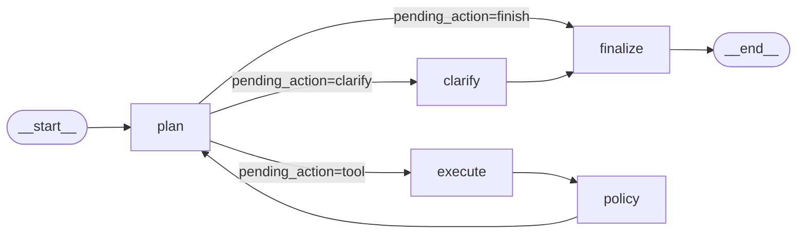
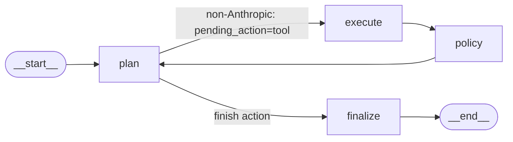
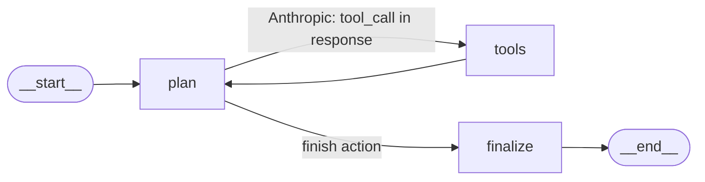
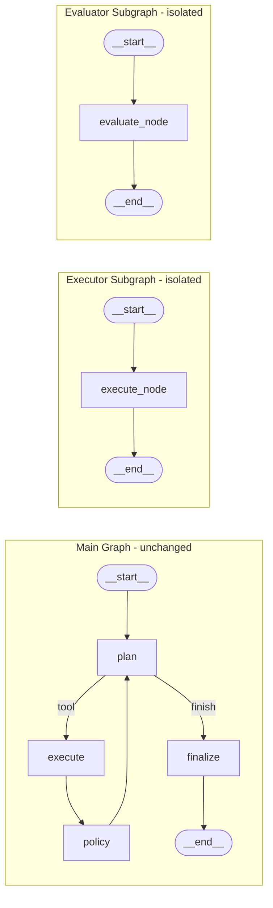
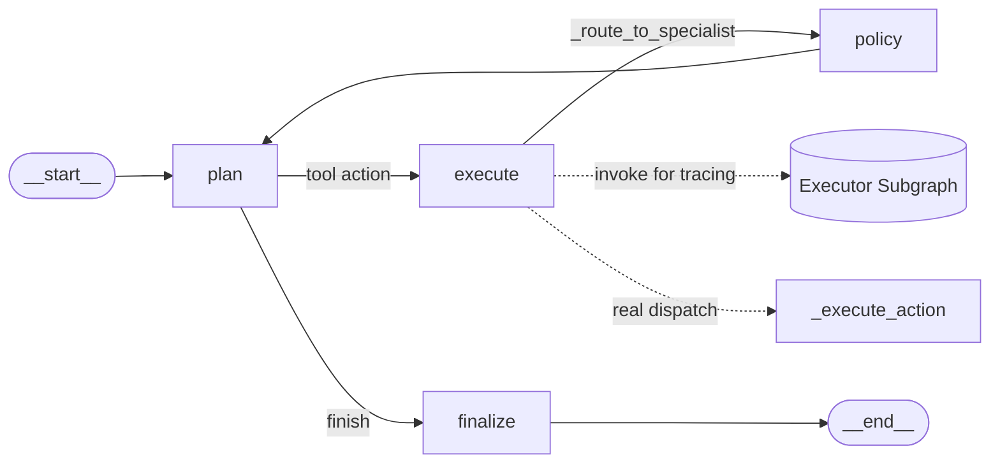

# Agentic Workflows: Graph Topology Progression (Phases 1–4)

This document captures the LangGraph orchestrator's structural evolution across phases 1–4.
Written for the implementation author — no LangGraph introductions. Each section shows the
actual node/edge topology at that phase boundary and the rationale for the changes.

---

## Phase 1: Baseline Single-Loop Graph

**Nodes:** `plan`, `execute`, `policy`, `finalize`, `clarify` (stub)



Single compiled graph, sequential single-branch execution. `RunState` holds ~15 fields;
`tool_history` is a plain `list[ToolRecord]` with no reducers — safe because the graph is
fully sequential (no parallel `Send()` branches) and state updates are atomic per node.

`MissionAuditor` runs 9 post-run checks at `_finalize()` time, producing `audit_report`.
`ScriptedProvider` replays pre-baked responses for deterministic test coverage without
live API calls.

The `clarify` node is a routing stub present in the edge map but never reached in practice
during Phase 1 test runs.

---

## Phase 2: LangGraph 1.0 Upgrade — Annotated Reducers + Anthropic ToolNode

**Change trigger:** `langgraph<1.0` pin removal (ADR-001). `ToolNode` and `Annotated` reducers
require LangGraph 1.0 APIs.

**Standard path** (non-Anthropic providers — identical topology to Phase 1):



**Anthropic path** (new conditional branch via `add_conditional_edges`):



`tools_condition` routes `plan → tools` when the Anthropic response contains a `tool_calls`
block; `tools → plan` loops back after `ToolNode` executes the native tool call.

**Annotated reducers** on 4 `RunState` list fields:
- `tool_history: Annotated[list[ToolRecord], operator.add]`
- `mission_reports: Annotated[list[MissionReport], operator.add]`
- `memo_events: Annotated[list[MemoEvent], operator.add]`
- `seen_tool_signatures: Annotated[list[str], operator.add]`

`operator.add` prevents silent list overwrite when parallel `Send()` branches merge state.
`_sequential_node()` wrapper zeros these fields in the return dict for sequential paths
(`operator.add(post_list, [])` = no-op, preserving accumulated state).

**Message compaction:** sliding window at `P1_MESSAGE_COMPACTION_THRESHOLD` (default 40)
truncates the oldest messages before each planner call to stay within context limits.

`@observe()` applied to `run()` and `main()` (no-op until langfuse is configured).

---

## Phase 3: Specialist Subgraph Architecture — State Isolation

**New:** `ExecutorState` and `EvaluatorState` TypedDicts compiled into isolated subgraphs.
Main graph topology unchanged from Phase 2 standard path.



**State isolation contract:** `ExecutorState` uses `exec_`-prefixed fields;
`EvaluatorState` uses `eval_`-prefixed fields. The `__annotations__` key sets of both
substate types are disjoint from each other and from `RunState` — verified by
`assert set(RunState.__annotations__).isdisjoint(ExecutorState.__annotations__)` in tests.

`build_executor_subgraph()` and `build_evaluator_subgraph()` compile independently in
`__init__()` and are cached as `self._executor_subgraph` / `self._evaluator_subgraph`.
Neither subgraph is integrated into the main graph routing in Phase 3 — they run in isolation
only. Rationale: validate subgraph correctness and state boundary in isolation before wiring
into real routing in Phase 4.

---

## Phase 4: Multi-Agent Integration — Real Subgraph Routing + Model Routing

**New:** `_route_to_specialist()` called inside `execute` node. Parallel-invoke pattern.
Real `ModelRouter` wired in `__init__()`.



**Parallel-invoke pattern in `execute` node:**
1. `self._executor_subgraph.invoke(exec_state)` — records real subgraph node transitions
   in Langfuse/LangGraph trace; `exec_state` result is discarded to prevent double-execution.
2. `self._execute_action(state)` — real tool dispatch through the full pipeline
   (arg normalization, duplicate detection, auto-memo-lookup, content validation, mission
   attribution). Newly appended `tool_history` entries are tagged `via_subgraph=True`.

The evaluator subgraph is compiled in `__init__()` but never called via compiled subgraph
`invoke()` in the execution path. It is invoked only at `_finalize()` time via `audit_run()`,
which calls the evaluator logic directly. Routing it through the compiled subgraph mid-run
would risk partial-audit overwrites on `RunState`.

**`ModelRouter`** makes real routing decisions based on complexity signals:
`token_budget_remaining` and mission-type keywords. Previously a hardcoded stub returning
`"strong"` unconditionally.

---

## Phase 5: Langfuse CallbackHandler Wiring (this phase)

`get_langfuse_callback_handler()` returns a `LangchainCallbackHandler` when
`LANGFUSE_PUBLIC_KEY` + `LANGFUSE_SECRET_KEY` are set; returns `None` otherwise
(no console auth warnings in test environments).

`run()` builds `self._active_callbacks` once per invocation:

```python
self._active_callbacks: list[Any] = []
_handler = get_langfuse_callback_handler()
if _handler is not None:
    self._active_callbacks = [_handler]
```

Both compiled graph invocations receive the callback list:
- `self._compiled.invoke(state, config={"recursion_limit": N, "callbacks": self._active_callbacks})`
- `self._executor_subgraph.invoke(exec_state, config={"callbacks": self._active_callbacks})`

Zero node changes — additive-only. `@observe(name="provider.generate")` applied to
`OllamaChatProvider.generate` (was a no-op due to langfuse 3.x import path change:
`langfuse.decorators` removed, `from langfuse import observe` is the 3.x path).

---

## Architecture Summary: What Changed Across Phases

| Change | Phase | Files | Why |
|--------|-------|-------|-----|
| Annotated reducers on 4 list fields | Phase 2 | `state_schema.py` | parallel `Send()` safety |
| ToolNode for Anthropic path | Phase 2 | `graph.py` | native `tool_calls` handling |
| `ExecutorState`/`EvaluatorState` isolation | Phase 3 | `specialist_executor.py`, `specialist_evaluator.py` | separate compilation, testability |
| `_route_to_specialist()` | Phase 4 | `graph.py` | real subgraph delegation |
| Parallel-invoke pattern | Phase 4 | `graph.py` | tracing + real dispatch without double-execution |
| `ModelRouter` | Phase 4 | `model_router.py` | complexity-based provider selection |
| Langfuse CallbackHandler wiring | Phase 5 | `graph.py`, `observability.py` | automatic node transition tracing |
| `@observe` on `OllamaChatProvider.generate` | Phase 5 | `provider.py` | span-level tracing per generate call |

---

## Key Design Decisions

ADR references — see `docs/ADR/` for full rationale:

- **ADR-001:** langgraph<1.0 pin removal — required for `ToolNode`, `Annotated` reducers, LangGraph 1.0 state APIs
- **ADR-002:** `TypedDict` for `RunState` — LangGraph-native; `Pydantic BaseModel` incompatible with LangGraph state management
- **ADR-003:** Annotated reducers — required for any parallel `Send()` fan-out (PRLL-01 milestone requirement)
- **ADR-004:** `ToolNode` for Anthropic path only — preserves existing non-Anthropic paths unchanged; avoids cross-provider regressions
